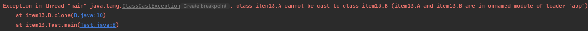

# Item 13 - clone 재정의는 주의해서 진행하라

clone() 메서드는 Object 클래스의 멤버 메서드이며, 객체 복사를 하기 위해서 이 메서드를 이용한다. 객체는 참조를 기본으로 하고 있기 때문에 객체는 할당의 의미이지 객체 복사의 개념은 아니다.
따라서 객체의 완전한 메모리 복사는 Object 클래스의 메서드인 clone() 메서드가 제공하고 있다.

clone() 메서드를 사용하려면 복제해도 되는 클래스임을 명시하는 용도의 믹스인 인터페이스(mixin interface) Cloneable 인터페이스를 상속 받아야 하지만 의도한 목적을 제대로 이루지 못했다.

- clone() 메서드가 선언된 곳이 Cloneable 이 아닌 Object
- clone() 메서드의 접근 제한자가 protected

```java
public class Object {
		...
		@IntrinsicCandidate
    protected native Object clone() throws CloneNotSupportedException;
		...
}
```

```java
package java.lang;

public interface Cloneable {
}
```

따라서 Cloneable 을 구현하는 것만으로는 외부 객체에서 clone 메서드를 호출할 수 없다.

Cloneable 인터페이스는 메서드가 하나도 없는데 이 인터페이스는 Object의 protected 메서드인 clone의 동작 방식을 결정한다.

- clone 을 호출하면 그 객체의 필드들을 하나하나 복사한 객체를 반환한다.
- 그렇지 않은 클래스를 호출하면 CloneNotSupportedException을 던진다.
- 인터페이스를 상당히 이례적으로 사용한 예이니 따라하면 안된다.

**실무에서 Cloneable을 구현한 클래스는 clone 메서드를 public으로 제공하며, 사용자는 당연히 복제가 제대로 이뤄지라 기대한다.**

이는 생성자를 호출하지 않고도 객체를 생성할 수 있게 되어 깨지기 쉽고, 위험하고, 모순적인 프로토콜을 지켜야 한다.

clone 메서드의 일반 규약

```java
Creates and returns a copy of this object. The precise meaning of "copy"
may depend on the class of the object. The general intent is that,
for any object x, the expression:

  x.clone() != x
will be true, and that the expression:

  x.clone().getClass() == x.getClass()
will be true, but these are not absolute requirements. While it is typically 
the case that:

  x.clone().equals(x)
will be true, this is not an absolute requirement.

By convention, the returned object should be obtained by calling super.clone.
If a class and all of its superclasses (except Object) obey this convention, 
it will be the case that x.clone().getClass() == x.getClass().
```

> 이 객체의 복사본을 생성해 반환한다. ‘복사’의 정확한 뜻은 그 객체를 구현한 클래스에 따라 다를 수 있다. 일반적인 의도는 다음과 같다. 어떤 객체 x에 대해 다음 식은 참이다.

x.clone() ≠ x

또한 다음 식도 참이다.

x.clone().getClass() == x.getClass()

하지만 이상의 요구를 반드시 만족해야 하는 것은 아니다.
한편 다음 식도 일반적으로 참이지만, 역시 필수는 아니다.

x.clone().equals(x)

관례상, 이 메서드가 반환하는 객체는 super.clone을 호출해 얻어야 한다. 이 클래스와 (Object)를 제외한 모든 상위 클래스가 이 관례를 따른다면 다음 식은 참이다.

x.clone().getClass() == x.getClass()

관례상, 반환된 객체와 원본 객체는 독립적이어야 한다. 이를 만족하려면 super.clone으로 얻은 객체의 필드 중 하나 이상을 반환 전에 수정해야 할 수도 있다.
> 

생성자 연쇄와 살짝 비슷하다. 따라서 super.clone이 아닌, 생성자를 호출해 얻은 인스턴스를 반환해도 컴파일러는 불평하지 않는다.

하지만 하위 클래스에서 super.clone을 호출하면 잘못된 클래스의 객체가 만들어져, clone 메서드가 제대로 동작하지 않게 된다.

```java
public class A implements Cloneable {
    private int id;
    private String name;

    public A(int id, String name) {
        this.id = id;
        this.name = name;
    }

    @Override
    public Object clone() throws CloneNotSupportedException {
        return new A(id, name);
    }
}
```

```java
public class B extends A implements Cloneable{
    public B(int id, String name) {
        super(id, name);
    }

    @Override
    public B clone() throws CloneNotSupportedException {
        return (B) super.clone();
    }
}

B b = new B(1, "hello");
B b2 = b.clone();
```



상위 클래스 A의 clone 에서 A 인스턴스가 생성되어 캐스팅 에러가 나는 것을 볼 수 있다.

---

제대로 동작하는 clone 메서드를 가진 상위 클래스를 상속해 Cloneable 을 구현하면 먼저 super.clone 을 호출하며 얻은 객체는 원본의 완벽한 복제본이다. 

- 모든 필드가 기본 타입이거나 불변 객체를 참조한다면 이 객체는 더 손볼 것이 없다. 하지만 쓸데없는 복사를 지양한다는 관점에서 보면 불변 클래스는 굳이 clone 메서드를 제공하지 않는게 좋다.

```java
public class PhoneNumber implements Cloneable {
		...
		@Override
		public PhoneNumber clone() {
		    try {
		        return (PhoneNumber) super.clone();
		    } catch (CloneNotSupportedException e) {
		        throw new AssertionError();
		    }
		}
		...
}
```

clone 메서드는 Object를 반환하지만 PhoneNumber의 clone 메서드는 PhoneNumber 을 반환하게 만들어 준다.

- 자바는 공변 반환 타이핑을 지원하므로 이렇게 하는 것이 가능하고 권장하는 방식
- 재정의한 메서드의 반환 타입은 상위 클래스의 메서드가 반환하는 타입의 하위 타입일 수 있다.
- 이 방식으로 클라이언트가 형변환하지 않아도 된다.

클래스가 가변 객체를 참조하는 순간 매우 복잡해진다.

```java
public class Stack implements Cloneable {
    private Object[] elements;
    private int size = 0;
    private static final int DEFAULT_INITIAL_CAPACITY = 16;

    public Stack() {
        elements = new Object[DEFAULT_INITIAL_CAPACITY];
    }

    private void ensureCapacity() {
        if(elements.length == size) {
            elements = Arrays.copyOf(elements, 2 * size + 1);
        }
    }

    public Object pop() {
        if(size == 0) {
            throw new EmptyStackException();
        }
        Object ret = elements[--size];
        elements[size] = null;
        return ret;
    }

    public void push(Object e) {
        ensureCapacity();
        elements[size++] = e;
    }

    @Override
    public Stack clone() {
        try {
            return (Stack) super.clone();
        } catch (CloneNotSupportedException e) {
            throw new AssertionError();
        }
    }
}
```

단순히 Stack 클래스만 super.clone 하게되면 size필드는 올바른 값을 갖게되지만, elements 필드는 원본 Stack 인스턴스와 똑같은 배열을 참조할 것이다.

```java
Integer i = 1;
Stack s = new Stack();
s.push(i);

Stack cloneStack = s.clone();

Integer originalElement = (Integer) s.pop();
Integer cloneElement = (Integer) cloneStack.pop();

System.out.println(originalElement);
System.out.println(cloneElement);
```


위의 결과를 보면 복제본에서 pop 을 하면 1이 나올 것이라 기대했지만 null 이 나오는 것을 볼 수 있다. 이는 elements 를 공유하고 있다.

- **clone 메서드는 사실상 생성자와 같은 효과를 낸다. clone은 원본 객체에 아무런 해를 끼치지 않는 동시에 복제된 객체의 불변식을 보장해야 한다.**

따라서 Stack의 clone 메서드가 제대로 동작하려면 스택 내부 정보를 복사해야 하고 elements 배열의 clone을 재귀적으로 호출해 줘 복사해준다.

```java
@Override
public Stack clone() {
    try {
        Stack result = (Stack) super.clone();
        result.elements = elements.clone();
        return result;
    } catch (CloneNotSupportedException e) {
        throw new AssertionError();
    }
}
```

- 배열의 clone 은 런타임과 컴파일 타임 타입 모두 원본 배열과 똑같은 배열을 반환한다.
- 배열을 복제할 때는 배열의 clone 메서드 사용 (배열은 clone 기능을 제대로 사용하는 유일한 예)

하지만 elements 필드가 final 로 선언이 되어있으면 final 필드에는 새로운 값을 할당할 수 없으므로 새로운 값을 할당할 수 없는 근본적인 문제가 발생한다.

- **Cloneable 아키텍처는 ‘가변객체를 참조하는 필드는 final로 선언하라’는 일반 용법과 충돌**

clone 을 재귀적으로 호출하는 것만으로는 충분하지 않은 경우도 있다.

해시테이블이 있으며 내부는 버킷들의 배열이고, 각 버킷은 키-값 쌍을 담는 연결 리스트의 첫 번째 엔트리를 참조한다고 하자.

```java
public class HashTable implements Cloneable {
    private Entry[] buckets = ...;

    private static class Entry {
        final Object key;
        Object value;
        Entry next;

        Entry(Object key, Object value, Entry next) {
            this.key = key;
            this.value = value;
            this.next = next;
        }
				...
    }

    @Override
    public Object clone() {
        try {
            HashTable result = (HashTable) super.clone();
            result.buckets = buckets.clone();
            return result;
        } catch (CloneNotSupportedException e) {
            throw new AssertionError();
        }
    }
}
```

복제본은 자신만의 버킷 배열을 갖지만, 이 배열은 원본과 같은 연결 리스트를 참조하여 원본과 복제본 모두 예기치 않게 동작할 가능성이 생긴다. 이를 해결하려면 각 버킷을 구성하는 연결 리스트를 복사해야 한다.

### 연결 리스트 복사

```jsx
public class HashTable implements Cloneable {
    private Entry[] buckets;

    private static class Entry {
        final Object key;
        Object value;
        Entry next;

        Entry(Object key, Object value, Entry next) {
            this.key = key;
            this.value = value;
            this.next = next;
        }

        Entry deepCopy() {
            return new Entry(key, value, next == null ? null : next.deepCopy());
        }
    }

    @Override
    public Object clone() {
        try {
            HashTable result = (HashTable) super.clone();
            result.buckets = new Entry[buckets.length];
            for(int i=0; i<buckets.length; i++) {
                if(buckets[i] != null) {
                    result.buckets[i] = buckets[i].deepCopy();
                }
            }
            return result;
        } catch (CloneNotSupportedException e) {
            throw new AssertionError();
        }
    }
}
```

1. HashTable의 clone 메서드는 먼저 적절한 크기의 새로운 버킷 배열을 할당.
2. 원래의 버킷 배열을 순회하며 비지 않은 각 버킷에 대해 깊은 복사
3. Entry의 deepCopy() 메서드는 자신이 가리키는 연결 리스트 전체를 복사하기 위해 재귀적으로 호출

버킷이 너무 길지 않으면 잘 작동하지만 재귀호출로 인해 리스트의 원소 수만큼 스택 프레임을 소비해, 리스트가 길면 스택 오버플로우가 발생할 위험이 있다.

이를 해결하기 위해 재귀대신 반복자를 사용하는 방법도 있다.

```java
Entry deepCopy() {
    Entry result = new Entry(key, value, next);
    for(Entry p = result; p.next != null; p = p.next) {
        p.next = new Entry(p.next.key, p.next.value, p.next.next);
    }
    return result;
}
```

### 복잡한 가변 객체를 복제하는 다른 방법

```java
public Object put(Object key, Object value) {
    // Make sure the value is not null
    if (value == null) {
        throw new NullPointerException();
    }

    // Makes sure the key is not already in the hashtable.
    Entry tab[] = buckets;
    int hash = key.hashCode();
    int index = (hash & 0x7FFFFFFF) % tab.length;

    Entry entry = (Entry)tab[index];
    for(; entry != null ; entry = entry.next) {
        if ((entry.hash == hash) && entry.key.equals(key)) {
            Object old = entry.value;
            entry.value = value;
            return old;
        }
    }

    addEntry(hash, key, value, index); // Entry 추가 메서드
    return null;
}

@Override
public Object clone() {
    try {
        HashTableHigh result = (HashTableHigh) super.clone();
        result.buckets = new Entry[buckets.length];
        for (int i = 0; i < buckets.length; i++) {
            if(buckets[i] != null) {
                for(Entry p = buckets[i]; p != null; p = p.next) {
                    result.put(p.key, p.value);
                }
            }
        }
    
        return result;
    } catch (CloneNotSupportedException e) {
        throw new AssertionError();
    }
}
```

1. super.clone 을 호출
2. 얻은 객체의 모든 필드를 초기상태로 설정한 후, 원본 객체의 상태를 다시 생성하는 고수준 메서드들을 호출
3. 위의 예에서 buckets 필드를 초기화한 후 테이블에 담긴 모든 키-값 쌍 각각에 대해 복제본 테이블의 put(key, value) (위의 메서드 코드는 java.util.HashTable 클래스의 put 메서드 일부) 메서드를 호출해 둘의 내용이 똑같게 해준다.

고수준의 API 를 활용해 복제하면 간단하고 제법 우아한 코드를 얻게 되지만 성능상 느리다.
또한 Cloneable 아키텍쳐의 기초가 되는 필드 단위 객체 복사를 우회하기 때문에 전체 Cloneable 아키텍쳐와는 어울리지 않는 방식이기도 하다.

### java.util.HashTable 에서의 clone

```java
public class Hashtable<K,V>
    extends Dictionary<K,V>
    implements Map<K,V>, Cloneable, java.io.Serializable {

....

				public synchronized Object clone() {
				    Hashtable<?,?> t = cloneHashtable();
				    t.table = new Entry<?,?>[table.length];
				    for (int i = table.length ; i-- > 0 ; ) {
				        t.table[i] = (table[i] != null)
				            ? (Entry<?,?>) table[i].clone() : null;
				    }
				    t.keySet = null;
				    t.entrySet = null;
				    t.values = null;
				    t.modCount = 0;
				    return t;
				}

.......
				private static class Entry<K,V> implements Map.Entry<K,V> {
				        final int hash;
				        final K key;
				        V value;
				        Entry<K,V> next;

				        protected Entry(int hash, K key, V value, Entry<K,V> next) {
				            this.hash = hash;
				            this.key =  key;
				            this.value = value;
				            this.next = next;
				        }
......
				        @SuppressWarnings("unchecked")
				        protected Object clone() {
				            return new Entry<>(hash, key, value,
				                                  (next==null ? null : (Entry<K,V>) next.clone()));
				        }
.......
				}
}
```

---

**생성자에서는 재정의 될 수 있는 메서드를 호출하지 않아야 하**는데 이는 clone 메서드도 마찬가지이다.

- 클론이 하위 클래스에서 재정의한 메서드를 호출하면, 하위 클래스는 복제 과정에서 자신의 상태를 교정할 기회를 잃게 되어 원본과 복제본의 상태가 달라질 가능성이 크다.
- 위의 예제에서 put 메서드는 clone 에서 사용되는 메서드이므로 final 이거나 private 이어야 한다.

Object의 clone 메서드는 CloneNoSupportedException을 던진다고 선언하지만 재정의한 메서드는 그렇지 않다.

- public 인 clone 메서드에서는 throws 절을 없애야 한다.
- 검사 예외를 던지지 않아야 그 메서드를 사용하기 편해진다.

상속용 클래스는 Cloneable을 구현해서는 안 된다. 

- Object 방식을 모방해 제대로 작동하는 clone 메서드 구현 후 protected 로 두고 CloneNotSupportedException도 던질 수 있다고 선언 → Cloneable 구현 여부를 하위 클래스에서 선택하도록 해준다.
- clone 을 동작하지 않게 구현해 놓고 하위 클래스에서 재정의하지 못하게 한다.

```java
@Override
protected final Object clone() throws CloneNotSupportedException() {
		throw new CloneNotSupportedException();
}
```

Cloneable을 구현한 스레드 안전 클래스를 작성할 때는 clone 메서드도 동기화 해주어야 한다.

**요약**

- Cloneable을 구현하는 모든 클래스는 clone 을 재정의해야 한다.
- 접근 제한자는 public으로 반환 타입은 클래스 자신으로 변경
- super.clone을 호출한 후 필요한 필드를 전부 적절히 수정
- 객체 내부 ‘깊은 구조’의 모든 가변 객체를 복사하고, 복제본이 가진 객체 참조 모두가 복사된 객체들을 가리키게 한다.
- 일련번호나 고유 ID는 비록 기본타입이나 불변일지라도 수정해줘야 한다.

### 복사 생성자와 복사 팩터리

위의 clone 작업이 꼭 필요한 복잡한 경우는 드물다.

Cloneable 을 이미 구현한 클래스를 확장한다면 clone 을 잘 작동하도록 구현해야 하지만 그렇지 않은 상황에서는 **복사 생성자와 복사 팩터리라는 더 나은 객체 복사 방식을 제공할 수 있다.**

- 복사 생성자

```java
public Yum(Yum yum) {...};
```

- 복사 팩터리

```java
public static Yum newInstance(Yum yum) {...};
```

**복사 생성자와 복사 팩터리는 Cloneable/clone 방식보다 나은 면이 더 많다.**

- 생성자를 사용하지 않는 객체 생성 메커니즘을 사용하지 않는다.
- 문서화된 규약에 기대지 않고, 정상적인 final 필드 용법과도 충돌하지 않는다.
- 불필요한 검사 예외를 던지지 않고, 형변환도 필요치 않다.
- 복사 생성자와 복사 팩터리는 해당 클래스가 구현한 ‘인터페이스’ 타입의 인스턴스를 인수로 받을 수 있다.

인터페이스 기반 복사 생성자와 복사 팩터리의 더 정확한 이름은 ‘변환 생성자(conversion constructor)’와 변환 팩터리(conversion factory)’다.

이들을 이용하면 원본의 구현 타입에 얽매이지 않고 복제본의 타입을 직접 선택할 수 있다. 예를 들어 HashSet 객체 s 를 TreeSet 타입으로 복제할 수 있다.

```java
HashSet<Integer> s = new HashSet<>();
TreeSet<Integer> t = new TreeSet<>(s);
```

---

> Cloneable이 몰고 온 모든 문제를 되짚어 봤을 때, 새로운 인터페이스를 만들 때는 절대 Cloneable 을 확장해서는 안되며, 새로운 클래스도 이를 구현해서는 안 된다. final 클래스라면 Cloneable 을 구현해도 위험이 크지 않지만, 성능 최적화 관점에서 검토한 후 별다른 문제가 없을 때만 드물게 허용해야 한다. 기본 원칙은 ‘복제 기능은 생성자와 팩터리를 이용하는게 최고’라는 것. 단, 배열만은 clone 메서드 방식이 가장 깔끔한, 이 규칙의 합당한 예외가 될 수 있다.
>