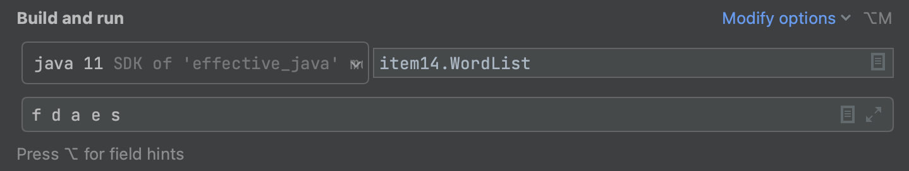
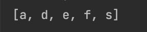
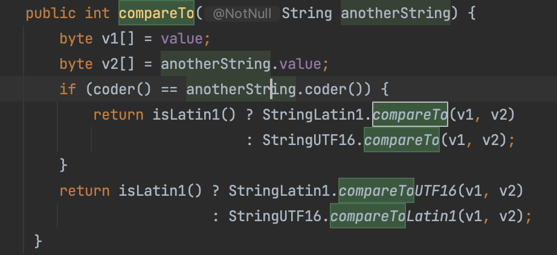

# Item 14 - Comparable을 구현할지 고려하라

## Comparable

```java
public interface Comparable<T> {
    public int compareTo(T o);
}
```

compareTo

- 동치성 비교
- 순서
- 제너릭

compareTo 는 위와 같은 기능을 가지고 있어 Comparable을 구현한다는 것은 클래스의 인스턴스들에는 자연적인 순서가 있음을 의미한다.

```java
Arrays.sort(a);
```

Comparable을 구현한 객체는 위 sort() 메서드를 이용해 쉽게 정렬할 수 있다.

String이 Comparable 을 구현하고 있어 다음 클래스의 main 메서드는 명령줄 인수들을 알파벳순으로 출력한다.

```java
public class WordList {
    public static void main(String[] args) {
        Set<String> s = new TreeSet<>();
        Collections.addAll(s, args);
        System.out.println(s);
    }
}
```





**String 클래스의 Comparable을 구현한 compareTo 메서드**



Comparable 을 구현한 간단한 코드로 이 인터페이스를 활용하는 수많은 제네릭 알고리즘과 컬렉션의 힘을 누릴 수 있다.

알파벳, 숫자, 연대 같이 순서가 명확한 값 클래스를 작성한다면 반드시 Comparable 인터페이스를 구현하자.

### compareTo 메서드의 일반규약

이 객체와 주어진 객체의 순서를 비교

이 객체가 주어진 객체보다 작으면 음의 정수를, 같으면 0, 크면 양의 정수를 반환한다.

이 객체와 비교할 수 없는 타입의 객체가 주어지면 ClassCastException을 던진다.

- campareTo javadocs
  Compares this object with the specified object for order. Returns a negative integer, zero, or a positive integer as this object is less than, equal to, or greater than the specified object.
  The implementor must ensure sgn(x.compareTo(y)) == -sgn(y.compareTo(x)) for all x and y. (This implies that x.compareTo(y) must throw an exception iff y.compareTo(x) throws an exception.)
  The implementor must also ensure that the relation is transitive: (x.compareTo(y) > 0 && y.compareTo(z) > 0) implies x.compareTo(z) > 0.
  Finally, the implementor must ensure that x.compareTo(y)==0 implies that sgn(x.compareTo(z)) == sgn(y.compareTo(z)), for all z.
  It is strongly recommended, but not strictly required that (x.compareTo(y)==0) == (x.equals(y)). Generally speaking, any class that implements the Comparable interface and violates this condition should clearly indicate this fact. The recommended language is "Note: this class has a natural ordering that is inconsistent with equals."
  In the foregoing description, the notation sgn(expression) designates the mathematical signum function, which is defined to return one of -1, 0, or 1 according to whether the value of expression is negative, zero, or positive, respectively.

> 다음 설명에서 sgn(표현식) 표기는 수학에서 말하는 부호 함수(signum function)를 뜻한다. 표현식의 값이 음수, 0, 양수 일때 -1, 0, 1을 반환하도록 정의했다.

- Comparable을 구현한 클래스는 모든 x, y에 대해 **sgn(x.compareTo(y)) == -sgn(y.compareTo(x))**여야 한다.(x.compareTo(y) 는 y.compareTo(y)는 y.compareTo(x)가 예외를 던질때에 한해 예외를 던져야 한다.)
- Comparable을 구현한 클래스는 추이성을 보장해야 한다. 즉, **(x.compareTo(y) > 0 && y.compareTo(z) > 0 이면 x.compareTo(z) > 0** 이다.
- Comparable을 구현한 클래스는 모든 z에 대해 **x.compareTo(y) == 0 이면 sgn(x.compareTo(z)) == sgn(y.compareTo(z))** 이다.
- 이 권고가 필수는 아니지만 꼭 지키는게 좋다. **(x.compareTo(y) == 0) == (x.equals(y))** 여야 한다. Comparable을 구현하고 이 권고를 지키지 않는 모든 클래스는 그 사실을 명시해야 한다.
  - ex) “주의: 이 클래스의 순서는 equals 메서드와 일관되지 않다.”

### 1. **compareTo는 equals 와 달리 타입이 다른 객체를 신경쓰지 않아도 된다.**

- 타입이 다른 객체가 주어지면 대부분 간단하게 ClassCastException을 던진다.
- 보통은 비교할 객체들이 구현한 공통 인터페이스를 매개로 이뤄진다.

### 2. **주의점**

- 기존 클래스를 확장한 구체 클래스에서 새로운 값 컴포넌트를 추가했다면 compareTo 규약을 지킬 방법이 없다.
- Comparable을 구현한 클래스를 확장해 값 컴포넌트를 추가하고 싶다면, 확장하는 대신 독립된 클래스를 만들고, 이 클래스에 원래 클래스의 인스턴스를 가리키는 필드를 두자.
- 이후 내부 인스턴스를 반환하는 ‘뷰’ 메서드를 제공하면 된다.

### 3. **마직막 규약은 꼭 지키는 것이 좋다.**

compareTo의 순서와 equals 의 결과가 일관되지 않은 클래스도 여전히 동작은 한다.

- 이 클래스의 객체를 정렬된 컬렉션에 넣으면 해당 컬렉션이 구현한 인터페이스에 정의된 동작과 엇박을 낼 것이다.
- 이 인터페이스들은 equals 메서드 규약을 따른다 하지만 정렬된 컬렉션들은 동치성을 비교할 때 equals 대신 compareTo를 사용한다.

---

## 구현

- Comparable은 타입을 인수로 받는 제네릭 인터페이스이므로 compareTo 메서드의 인수 타입은 컴파일 타임에 정해진다.
- null 을 인수로 넣어 호출하면 NullPointerException을 던져야 한다.
- 객체 참조 필드를 비교하려면 compareTo 메서드를 재귀적으로 호출한다.
- Comparable 을 구현하지 않은 필드나 표준이 아닌 순서로 비교해야 한다면 비교자(Comparator)를 대신 사용한다.
  - 비교자는 직접 만들거나 자바가 제공하는 것 중 골라 사용

```java
public final class CaseInsensitiveString implements Comparable<CaseInsensitiveString> {
		public int compareTo(CaseInsensitiveString cis) {
				return String.CASE_INSENSITIVE_ORDER.compare(s, cis.s);
		}
}
```

- Comparable<CaseInsensitiveString>: CaseInsensitiveString 의 참조는 CaseInsensitiveString 참조와만 비교할 수 있다.
- 박싱된 기본 타입 클래스들에 새로 추가된 정적 메서드인 compare를 이용하자.
- **compareTo 메서드에서 관계연산자 < 와 > 를 사용하는 이전 방식은 거추장스럽고 오류를 유발하니, 이제는 추천하지 않는다.**
- 가장 핵심적인 필드부터 비교해 나가며 순서가 결정되면 그 결과를 곧장 반환하자.

```java
public int compareTo(PhoneNumber pn) {
		int result = Short.compare(areaCode, pn.areaCode);
		if(result == 0) {
				result = Short.compare(prefix, pn.prefix);
				if(result == 0) {
						result = Short.compare(lineNum, pn.lineNum);
				}
		}
		return result;
}
```

### 비교자 생성 메서드 (comparator construction method)

메서드 연쇄 방식으로 비교자를 생성 (약간의 성능 저하)

```java
private static final Comparator<PhoneNumber> COMPARATOR =
        Comparator.comparingInt((PhoneNumber pn) -> pn.getAreaCode())
                .thenComparingInt(pn -> pn.getPrefix())
                .thenComparingInt(pn -> pn.getLineNum());

public int compareTo(PhoneNumber pn) {
    return Comparator.comparing(this, pn);
}
```

비교자 생성 메서드 2개를 이용해 비교자를 생성한다.

**comparingInt((PhoneNumber pn) → …)**

- 객체 참조를 int 타입 키에 매핑하는 키 추출 함수를 인수로 받아, 그 키를 기준으로 순서를 정하는 비교자를 반환하는 정적 메서드 → Comparator<PhoneNumber>를 반환
- 자바의 타입 추론 능력이 타입을 알아낼 만큼 강력하지 않기 때문에 프로그램이 컴파일 되도록 타입을 명시해 준 것이다.

**thenComparingInt**

- 두 전화번호의 지역코드가 같을 수 있으므로 추가적인 비교 수행
- int 키 추출자 함수를 입력받아 다시 비교자를 반환한다.
- 원하는 만큼 연달아 호출할 수 있다.
- comparingInt 처럼 타입을 명시해 주지 않아도 자바가 알아서 타입을 추론해 낼 수 있다.

### 값의 차를 기준으로 비교

```java
private static final Comparator<Object> hashCodeOrder = new Comparator<Object>() {
    @Override
    public int compare(Object o1, Object o2) {
        return o1.hashCode() - o2.hashCode();
    }
};
```

**이 방식은 사용하면 안된다.**

- 정수 오버플로우를 일으킨다.
- IEEE 754 부동소수점 계산 방식에 따른 오류를 낼 수 있다.

**대신 정적 compare 메서드를 활용한 비교자를 사용하자.**

```java
// 1.
private static final Comparator<Object> hashCodeOrder = new Comparator<Object>() {
    @Override
    public int compare(Object o1, Object o2) {
        return Integer.compare(o1.hashCode(), o2.hashCode());
    }
};

--------------------------------------------------------------------------------
// 2.
private static final Comparator<Object> hashCodeOrder2 =
        Comparator.comparingInt(o -> o.hashCode());
```

---

<aside>
💡 순설를 고려해야 하는 값 클래스를 작성한다면 꼭 Comparable 인터페이스를 구현하여, 그 인스턴스들을 쉽게 정렬하고, 검색하고, 비교 기능을 제공하는 컬렉션과 어우러지도록 해야 한다. compareTo 메서드에서 필드의 값을 비교할 때 < 와 > 연산자는 쓰지 말아야한다. 대신 박싱된 기본 타입클래스가 제공하는 정적 compare 메서드나 Comparator 인터페이스가 제공하는 비교자 생성 메서드를 사용하자.

</aside>
