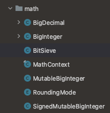
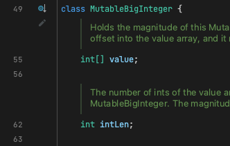
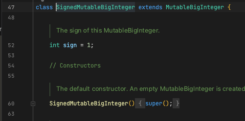

# Item 17 - 변경 가능성을 최소화 하라

불변 클래스: 인스턴스 내부 값을 수정할 수 없는 클래스

- 불변 인스턴스에 간직된 정보는 고정되어 객체가 파괴되는 순간까지 절대 달라지지 않는다.
- 자바 플랫폼의 불변 클래스: String, 기본 타입의 박싱된 클래스, BigInteger, BigDecimal…
- 불변 클래스는 가변 클래스보다 설계하고 구현하고 사용하기 쉽다.
- 오류가 생길 여지도 적고 훨씬 안전하다.

### 클래스를 불변으로 만들기 위한 5가지 규칙

1. **객체의 상태를 변경하는 메서드(변경자)를 제공하지 않는다.**
2. **클래스를 확장할 수 없도록 한다.**
   하위 클래스에서 부주의 하게 (혹은 나쁜 의도로) 객체의 상태를 변하게 만드는 사태를 막아준다.
3. **모든 필드를 final 로 선언한다.**
   - 시스템이 강제하는 수단을 이용해 설계자의 의도를 명확히 드러내는 방법
   - 새로 생성된 인스턴스를 동기화 없이 다른 스레드로 건네도 문제없이 동작하게끔 보장하는데도 필요
4. **모든 필드를 private 으로 선언한다.**
   - 필드가 참조하는 가변 객체를 클라이언트에서 직접 접근해 수정하는 일을 막아준다.
5. **자신 외에는 내부의 가변 컴포넌트에 접근할 수 없도록 한다.**
   - 클래스에 가변 객체를 참조하는 필드가 하나라도 있다면 클라이언트에서 그 객체의 참조를 얻을 수 없도록 해야 한다.
   - 클라이언트가 제공한 객체 참조를 가리키게 해서는 안되고 접근자 메서드가 그 필드를 그대로 반환해서도 안된다.
   - 생성자, 접근자, readObject 메서드 모드에서 방어적 복사를 수행

```java
public class Complex {
    private final double re;
    private final double im;

    public Complex(double re, double im) {
        this.re = re;
        this.im = im;
    }

    public double realPart() {
        return re;
    }

    public double imaginaryPart() {
        return im;
    }

    public Complex plus(Complex c) {
        return new Complex(re + c.re, im + c.im);
    }

    public Complex minus(Complex c) {
        return new Complex(re - c.re, im - c.im);
    }

    public Complex times(Complex c) {
        return new Complex(re * c.re - im * c.im, re * c.im + im * c.re);
    }

    public Complex dividedBy(Complex c) {
        double tmp = c.re * c.re + c.im * c.im;
        return new Complex((re * c.re + im * c.im) / tmp, (im * c.re - re * c.im) / tmp);
    }

    @Override
    public int hashCode() {
        return 31 * Double.hashCode(re) + Double.hashCode(im);
    }

    @Override
    public boolean equals(Object o) {
        if (o == this) {
            return true;
        }
        if(!(o instanceof Complex)) {
            return false;
        }
        Complex c = (Complex) o;

        return Double.compare(c.re, re) == 0 && Double.compare(c.im, im) == 0;
    }

    @Override
    public String toString() {
        return "(" + re + " + " + im + "i)";
    }
}
```

plus, minus, times, devidedBy 사칙연산 메서드들이 인스턴스 자신은 수정하지 않고 새로운 Complex 인스턴스를 만들어 반환하고 있다.

- 이와 같이 피연산자에 함수를 적용해 그 결과를 반환하지만, 피연산자 자체는 그대로인 프로그래밍 패턴을 함수형 프로그래밍이라고 한다.
  - 이와 달리, 절차적 혹은 명령형 프로그래밍에서는 메서드에서 피연사자인 자신을 수정해 자신의 상태가 변한다.
- 메서드 이름으로 동사대신 전치사를 사용 (add 대신 plus): 이는 해당 메서드가 객체의 값을 변경하지 않는다는 사실을 강조

이 방식으로 프로그래밍(함수형 프로그래밍)하면 코드에서 불변이 되는 영역의 비율이 높아지는 장점을 누릴 수 있다.

---

**불변 객체는 단순하다.**

- 생성된 시점의 상태를 파괴될 때까지 그대로 간직한다.
- 모든 생성자가 클래스 불변식을 보장한다면 그 클래스를 사용하는 프로그래머가 다른 노력을 들이지 않더라도 영원히 불변으로 남는다.
- 변경자 메서드가 일으키는 상태 전이를 정밀하게 문서로 남겨놓지 않은 가변 클래스는 믿고 사용하기 어려울 수 도 있다.

**불변 객체는 근본적으로 스레드 안전하여 따로 동기화할 필요 없다.**

- 여러 스레드가 동시에 사용해도 절대 훼손되지 않는다.
- 불변 객체에 대해서 그 어떤 스레드도 다른 스레드에 영향을 줄 수 없으니 불변 객체는 안심하고 공유할 수 있다.
- 불변 클래스라면 한번 만든 인스턴스를 최대한 재활용하기를 권한다.

```java
public static final Complex ZERO = new Complex(0, 0);
public static final Complex ONE  = new Complex(1, 0);
public static final Complex I    = new Complex(0, 1);
```

가장 쉬운 재활용 방법은 위와 같이 자주 쓰이는 값들을 상수 (public static final) 로 제공하는 것

- 자주 사용되는 인스턴스를 캐싱하여 같은 인스턴스를 중복 생성하지 않게 해주는 정적 팩터리를 제공할 수 있다.
- 정적 팩터리를 사용하면 여러 클라이언트가 인스턴스를 공유하여 메모리 사용량과 가비지 컬렉션 비용이 줄어든다.
- public 생성자 대신 정적 팩터리를 만들어두면, 클라이언트를 수정하지 않고도 필요에 따라 캐시 기능을 나중에 덧붙일 수 있다.

**불변 객체를 자유롭게 공유할 수 있다는 것은 방어적 복사도 필요 없게 된다.**

- 불변 클래스는 clone 메서드나 복사 생성자를 제공하지 않는게 좋다.
- String 클래스의 복사 생성자는 이 사실을 잘 이해하지 못한 자바 초창기 때 만들어진 것으로, 되도록 사용하지 말아야 한다.

**불변 객체는 자유롭게 공유할 수 있음은 물론, 불변 객체끼리는 내부 데이터를 공유할 수 있다.**

**객체를 만들 때 다른 불변 객체들을 구성요소로 사용하면 이점이 많다.**

**불변 객체는 그 자체로 실패 원자성을 제공한다.**

- 실패 원자성: 메서드에서 예외가 발생한 후에도 그 객체는 여전히 유효한 상태여야 한다는 성질
- 불변 객체는 내부 상태를 바꾸지 않으니 이 성질을 만족한다.

**값이 다르면 반드시 독립된 객체로 만들어야 한다.**

- 값의 가짓수가 많다면 이들을 모두 만드는데 큰 비용을 치러야 한다.

ex) 백만 비트 BigInteger에서 비트 하나를 바꾸는 경우

```java
BigInteger moby = ...;
moby = moby.flipBit(0);
```

여기서 flitBit 메서드는 return 을 할 때 새로운 인스턴스를 생성한다. (**원본과 단 1개의 비트만 다른 인스턴스**)

- BigInteger의 크기에 비례해 시간과 공간을 사용

```java
public BigInteger flipBit(int n) {
    if (n < 0)
        throw new ArithmeticException("Negative bit address");

    int intNum = n >>> 5;
    int[] result = new int[Math.max(intLength(), intNum+2)];

    for (int i=0; i < result.length; i++)
        result[result.length-i-1] = getInt(i);

    result[result.length-intNum-1] ^= (1 << (n & 31));

    return valueOf(result);
}

---------------------------------------------------------------------------

private static BigInteger valueOf(int val[]) {
    return (val[0] > 0 ? new BigInteger(val, 1) : new BigInteger(val));
}
```

BitSet은 BigInteger 와 달리 ‘가변’이다. 그래서 BigSet 클래스는 원하는 비트 하나만 상수 시간 안에 바꿔주는 메서드를 제공한다.

```java
BitSet moby = ...;
moby = moby.flip(0);

--------------------------------------------------------------------------------
public void flip(int bitIndex) {
    if (bitIndex < 0)
        throw new IndexOutOfBoundsException("bitIndex < 0: " + bitIndex);

    int wordIndex = wordIndex(bitIndex);
    expandTo(wordIndex);

    words[wordIndex] ^= (1L << bitIndex);

    recalculateWordsInUse();
    checkInvariants();
}
```

원하는 객체를 완성하기까지 단계가 많고 중간 단계에서 만들어진 객체들이 모두 버려진다면 성능에 크게 영향을 미친다. 이를 대처하는 방법이 존재한다.

**다단계 연산(multistep operation)들을 예측하여 기본 기능으로 제공**

단단계 연산을 기본으로 제공하면 각 단계마다 객체를 생성하지 않아도 된다.

BigInteger 는 다단계 연산 속도를 높여주는 가변 동반 클래스(companion class)를 package-private으로 두고 있다.







클라이언트의 원하는 복잡한 연산들을 정확히 예측할 수 있다면 package-private의 가변 동반 클래스만으로 충분하다.

가변 동반 클래스의 다른 예로는 String 과 StringBuilder가 존재한다.

---

클래스가 불변이기 위해서는 상속을 못하게 해야하고 이를 달성하기 위해 final 키워드를 class 에 붙혀주면 되지만 더 유연한 방법이 있다.

모든 생성자를 private 혹은 package-private 으로 만들고 public 정적 팩터리를 제공하는 방법이다.

```java
public class Complex {
		private final double re;
		private final double im;

		private Complex(double re, double im) {
				this.re = re;
				this.im = im;
		}

		public static Complex valueOf(double re, double im) {
				return new Complex(re, im);
		}

		.....
}
```

패키지 바깥의 클라이언트에서 바라본 이 불변 객체는 사실상 final이다. public 또는 protected 생성자가 없으므로 다른 패키지에서 이 클래스를 확장하는게 불가능하다.

정적 팩터리 방식은 다수의 구현 클래스를 활용한 유연성을 제공할 뿐만 아니라 다음 릴리스에서 객체 캐싱 기능을 추가해 성능을 끌어올릴 수도 있다.

불변클래스의 규칙에 따르면 모든 필드는 final 이며 어떤 메서드도 그 객체를 수정할 수 없어야 한다. 이 규칙을 성능을 위해 완화 시키면 “어떤 메서드도 객체의 상태 중 외부에 비치는 값을 변경할 수 없다.” 라 할 수 있다.

어떤 불변 클래스는 계산 비용이 큰 값을 나중에 계산하여 final이 아닌 필드에 캐시해 놓기도 한다. 캐시해 둔 값을 반환해 계산 비용을 절감한다.

---

### 정리

**클래스는 꼭 필요한 경우가 아니라면 불변이어야 한다.**

- 불변 클래스는 장점이 많으며 특정상황에서만 잠재적 성능 저하라는 단점만 존재한다.
- String 이나 BigInteger 같이 무거운 값 객체도 불변으로 만들 수 있을지 고민
- 성능 때문에 어쩔 수 없다면 불변 클래스와 쌍을 이루는 가변 동반 클래스를 public 클래스로 제공

**불변으로 만들 수 없는 클래스라도 변경할 수 있는 부분을 최소한으로 줄이자.**

- 꼭 변경해야 할 필드를 제외하고 나머지는 모두 final로 선언

**다른 합당한 이유가 없다면 모든 필드는 private final 이어야 한다.**

**생성자는 불변식 설정이 모두 완료된, 초기화가 완벽히 끝난 상태의 객체를 생성해야 한다.**

- 확실한 이유가 없다면 생성자와 정적 팩터리 외에는 그 어떤 초기화 메서드도 public으로 제공해서는 안된다.
- 객체를 재활용할 목적으로 상태를 다시 초기화하는 메서드도 안된다.
