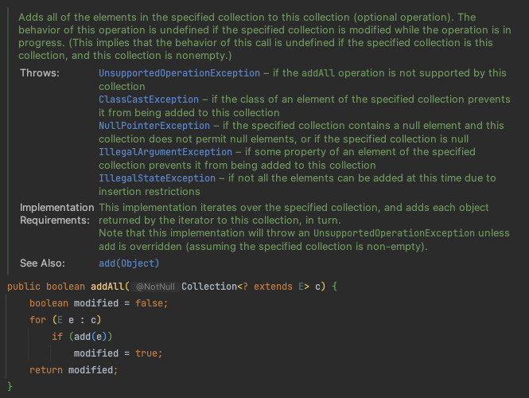
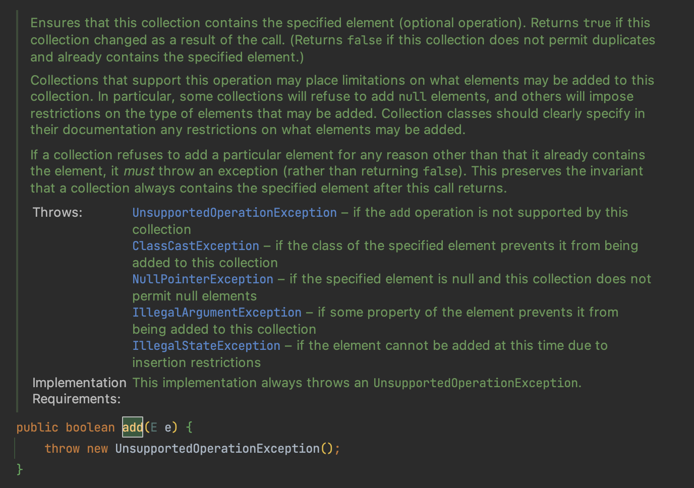
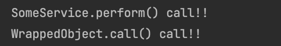

상속은 코드를 재사용하는 강력한 수단이지만, 항상 최선은 아니며 잘못 사용하게 되면 오류를 내기 쉬운 프로그램을 만든다.

상위 클래스와 하위 클래스를 모두 같은 프로그래머가 통제하는 패키지 안에서 다루거나 확장할 목적으로 설계되었고 문서화도 잘 된 클래스도 안전하다.

- 일반적인 구체 클래스를 패키지 경계를 넘어 다른 패키지의 구체 클래스를 상속하는 일은 위험하다.
- 여기서 ‘상속’은 **구현상속**을 말한다.

---

**메서드 호출과 달리 상속은 캡슐화를 깨뜨린다.**

- 상위 클래스가 어떻게 구현되느냐에 따라 하위 클래스의 동작에 이상이 생길 수 있다.
- 상위 클래스는 릴리스마다 구현이 달라질 수 있으며 이로인해 하위 클래스가 오동작을 일으킬 수 있다.

HashSet을 사용하는 프로그램에서 HashSet이 처음 생성된 이후 원소가 몇 개 더해졌는지 알 수 있게 하는 클래스를 작성한다고 하자.

추가된 원소의 수를 저장하는 변수와 접근자 메서드를 추가하고 HashSet에 원소를 추가하는 add와 addAll 메서드를 재정의 했다.

```java
public class InstrumentedHashSet<E> extends HashSet<E> {
    private int addCount = 0;
    public InstrumentedHashSet() {}

    public InstrumentedHashSet(int initCap, float loadFactor) {
        super(initCap, loadFactor);
    }

    @Override
    public boolean add(E e) {
        addCount++;
        return super.add(e);
    }

    @Override
    public boolean addAll(Collection<? extends E> c) {
        addCount += c.size();
        return super.addAll(c);
    }

    public int getAddCount() {
        return this.addCount;
    }
}
```

위의 InstrumentedHashSet은 제대로 동작하지 않는다.

```java
InstrumentedHashSet<String> s = new InstrumentedHashSet<>();
s.addAll(List.of("안녕", "하세", "요"));

System.out.println("추가된 원소 개수 = " + s.getAddCount());
```


3개의 원소가 추가된 것을 기대했지만 6개가 추가되었다고 나온다.

이유는 HashSet의 addAll 메서드가 add 메서드를 사용해 구현하기 때문이다.





HashSet의 addAll은 각 원소를 add 메서드를 호출해 추가하는데, 이때 불리는 add는 InstrumentedHashSet에서 재정의한 메서드이다.

따라서 addAll에서 3을 더한 값에 add에서 각각 1씩 더 더해주어 최종값이 6이 된 것이다.

이 경우 하위 메서드에서 addAll 메서드를 재정의하지 않으면 문제를 고칠 수 있지만 HashSet의 addAll이 add 메서드를 이용해 구현했음을 가정한 해법이라는 한계가 있다.

자신의 다른 부분을 사용하는 자기 사용(self-use) 여부는 해당 클래스의 내부 구현방식에 해당하여 자바 플랫폼 전반적인 정책인지, 다음 릴리스에 유지될지 알 수 없다.

addAll 메서드를 addAll 을 호출하지 않고 add 메서드만 활용하고 재정의 하는 방법이 있다.

- 하지만 상위 클래스의 메서드의 동작을 다시 구현하는 방식은 어렵고, 시간도 더 들며, 오류를 내거나 성능을 저하시킬 수 있다.
- 하위 클래스에서는 접근할 수 없는 private 필드를 사용하는 경우라면 구현자체가 불가능하다.

상속을 사용하게 되면 다음 릴리스에서 상위 클래스에 새로운 메서드가 추가되게 되면 하위 클래스가 깨지기 쉽다.

---

**기존 클래스를 확장하는 대신 새로운 클래스를 만들고 private 필드로 기존 클래스의 인스턴스를 참조하게 하자.**

- 이러한 설계를 컴포지션(composition)이라고 한다.
- 새 클래스의 인스턴스 메서드들은 기존 클래스의 대응하는 메서드를 호출해 그 결과를 반환한다.
- 위 방식을 전달(forwarding)이라고 하며, 새 클래스의 메서들을 전달 메서드(forwarding method) 라고 한다.
- 새로운 클래스는 기존 클래스의 내부 구현 방식의 영향에서 벗어날 수 있다.
- 새로운 클래스는 기존 클래스에 새로운 클래스가 추가 되어도 영향 받지 않는다.

### Composition을 사용한 InstrumentedSet

```java
public class InstrumentedHashSet<E> extends ForwardingSet<E> {
    private int addCount = 0;
    public InstrumentedHashSet(Set<E> s) {
        super(s);
    }

    @Override
    public boolean add(E e) {
        addCount++;
        return super.add(e);
    }

    @Override
    public boolean addAll(Collection<? extends E> c) {
        addCount += c.size();
        return super.addAll(c);
    }

    public int getAddCount() {
        return this.addCount;
    }
}
```

### ForwardingSet

```java
public class ForwardingSet<E> implements Set<E> {

    private final Set<E> s;

    public ForwardingSet(Set<E> s) { this.s = s; }

    @Override
    public int size() { return s.size(); }

    @Override
    public boolean isEmpty() { return s.isEmpty(); }

    @Override
    public boolean contains(Object o) { return s.contains(o); }

    @Override
    public Iterator<E> iterator() { return s.iterator(); }

    @Override
    public Object[] toArray() { return s.toArray(); }

    @Override
    public <T> T[] toArray(T[] a) { return s.toArray(a); }

    @Override
    public boolean add(E e) { return s.add(e); }

    @Override
    public boolean remove(Object o) { return s.remove(o); }

    @Override
    public boolean containsAll(Collection<?> c) { return s.containsAll(c); }

    @Override
    public boolean addAll(Collection<? extends E> c) { return s.addAll(c); }

    @Override
    public boolean retainAll(Collection<?> c) { return s.retainAll(c); }

    @Override
    public boolean removeAll(Collection<?> c) { return s.removeAll(c); }

    @Override
    public void clear() { s.clear(); }
}
```

- 다른 Set 인스턴스를 감싸고 있다는 뜻에서 InstrumentedSet 같은 클래스를 래퍼 클래스라고 한다.
- 다른 Set에 계측 기능을 덧씌운다는 뜻에서 데코레이터 패턴이라고 한다.
- 컴포지션과 전달의 조합은 넓은 의미로 위임(delegation)이라고 부른다.

### SELF 문제

래퍼 클래스는 콜백 프레임워크와는 어울리지 않는다.

- 콜백 프레임워크에서는 자기 자신의 참조를 다른 객체에 넘겨서 다음 호출(callback) 때 사용하도록 한다.
- 내부 객체는 자신을 감싸고 있는 래퍼의 존재를 모르기 때문에 자신의 참조(this)를 넘기게 되고 콜백때는 래퍼가 아닌 내부객체를 호출하게 된다. **이를 SELF 문제라고 한다.**

```java
public interface SomethingWithCallback {
    void doSomething();
    void call();
}

public class WrappedObject implements SomethingWithCallback {
    private final SomeService someService;

    public WrappedObject(SomeService someService) {
        this.someService = someService;
    }

    @Override
    public void doSomething() {
        someService.performAsync(this);
    }

    @Override
    public void call() {
        System.out.println("WrappedObject.call() call!!");
    }
}

public class Wrapper implements SomethingWithCallback {
    private final WrappedObject wrappedObject;

    public Wrapper(WrappedObject wrappedObject) {
        this.wrappedObject = wrappedObject;
    }

    @Override
    public void doSomething() {
        wrappedObject.doSomething();
    }

    @Override
    public void call() {
        System.out.println("Wrapper.call() call!!");
    }
}

public class SomeService {
    void performAsync(SomethingWithCallback callback) {
        perform();
        callback.call();
    }

    void perform() {
        System.out.println("SomeService.perform() call!!");
    }
}
```

참조: https://coderanch.com/t/670687/java/wrapper-class-suitable-callback-framework



someService.performAsync(this); 를 보면 performAsync 메서드의 인자로 this 인 wrappedObject가 들어가는 것을 볼 수있다. 따라서 내부 객체인 WrappedObject의 call() 메서드가 호출되는 것을 볼 수 있다. 즉, 래퍼 클래스의 메서드가 아닌 내부객체의 메서드를 호출하고 있다.

---

- 상속은 반드시 하위 클래스가 상위 클래스의 ‘진짜’ 하위 타입인 상황에서만 사용해야 한다.
  - 클래스 A 와 클래스 B 가 is-a 관계일 때만 클래스 B를 상속해야 한다.
- 컴포지션을 써야 하는 상황에서 상속을 사용하는 것은 내부 구현을 불필요하게 노출하는 것이다.
  - API가 내부 구현에 묶이고 그 클래스의 성능도 제한된다.
  - 심각한 것은 클라이언트가 노출된 내부에 직접 접근할 수 있게 된다.

상속을 사용하려는 경우

- 확장하려는 클래스의 API에 아무런 결함이 없는가
- 결함이 있다면, 이 결함이 클래스의 API까지 전파돼도 괜찮은가

---

> 정리

- 상속은 상위 클래스와 하위 클래스가 순수한 is-a 관계일 때만 써야 한다.
- is-a 관계라도 하위 클래스의 패키지가 상위 클래스와 다르고, 상위 클래스가 확장을 고려하지 않았다면 문제가 될 수 있다.
- 상속의 취약점을 피하기 위해 컴포지션과 전달을 사용하자
