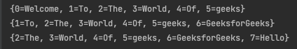

# item 7 - 다쓴 객체를 참조해제 하라

자바에서는 C 와 C++ 같이 사용자가 메모리를 직접 관리하는 것과는 다르게 다쓴 객체를 알아서 회수해 가주는 가비지 컬렉터라는게 존재해 코드의 작성이 훨씬 수월하다.

## 문제

하지만 가비지 컬렉터만 믿고 메모리 관리에 신경을 쓰지 않게 되면 프로그램에 문제가 생길 수 있다. 간단히 스택을 구현한 코드를 만들어 확인해 보자.

```java
public class Stack {
    private Object[] elements;
    private int size = 0;
    private static final int DEFAULT_INITIAL_CAPACITY = 16;
    
    public Stack() {
        elements = new Object[DEFAULT_INITIAL_CAPACITY];
    }
    
    private void ensureCapacity() {
        if(elements.length == size) {
            elements = Arrays.copyOf(elements, 2 * size + 1);
        }
    }
    
    public void push(Object e) {
        ensureCapacity();
        elements[size++] = e;
    }
    
    public Object pop() {
        if(size == 0) {
            throw new EmptyStackException();
        }
        return elements[--size];
    }
}
```

당장 보았을 때 문제가 없어 보인다. push와 pop 에 대해 테스트를 해보면 잘 작동을 한다. 하지만 메모리에 대해 생각을 해보면 메모리 누수가 생기는 문제가 있다.

위의 스택 코드에서 pop을 해줄 때 현재 size 만 줄여주면서 객체를 반환해 주고 있는데 가비지 컬렉터가 이 꺼내진 객체들을 더 이상 사용하지 않더라도 회수해 가지 않는다. 그 이유는 이 스택이 그 객체들의 다 쓴 참조(obsolete reference)를 여전히 가지고 있기 때문이다.

- 다쓴 참조: 말 그대로 다시 쓰지 않을 참조를 뜻한다. 위의 스택 코드에서는 elements 배열의 활성 영역 밖의 참조들이 모두 여기에 해당한다. (인덱스가 size보다 큰 원소들)

이렇게 가비지 컬렉터가 안쓰는 메모리를 회수해 가지 못하게 되면 메모리 누수가 생겨 프로그램을 오래 실행하게 되면 점점 가지비 컬렉션의 활동과 메모리 사용량이 늘어나 결국 성능이 떨어질 수밖에 없게 된다. 또한 심할경우에는 디스크 페이징이나 OutOfMemoryError를 일으켜 프로그램이 예기치 않게 종료되기도 한다.

## 다 쓴 참조 해제하기

메모리 누수는 찾기가 아주 까다롭다. 객체 참조 하나를 살려두면 가비지 컬렉터는 그 객체 뿐만 아니라 그 객체가 참조하는 모든 객체를 회수해 가지 못한다.

해결을 하는 방법은 간단하다. 해당 참조를 다 쓴 경우 null 처리(참조 해제) 를 해주면 된다.

**제대로 구현한 pop 메서드**

```java
public Object pop() {
    if(size == 0) {
        throw new EmptyStackException();
    }
    Object ret = elements[--size];
    elements[size] = null;  // 다 쓴 참조 해제
    return ret;
}
```

다 쓴 참조를 null 처리하면 가비지 컬렉터가 회수해 가주는 것 뿐만 사용자가 실수로 null 처리한 참조를 사용하면 NullPointerException 을 던지며 종료되어 프로그램 오류를 조기에 잡아낼 수 있다.

하지만 무작정 모든 객체를 다 쓰자마자 null 로 도배를 하게 되면 필요이상으로 프로그램을 지저분하게 만들 뿐이고 바람직하지 않다.

```java
public synchronized void removeElementAt(int index) {
    if (index >= elementCount) {
        throw new ArrayIndexOutOfBoundsException(index + " >= " +
                                                 elementCount);
    }
    else if (index < 0) {
        throw new ArrayIndexOutOfBoundsException(index);
    }
    int j = elementCount - index - 1;
    if (j > 0) {
        System.arraycopy(elementData, index + 1, elementData, index, j);
    }
    modCount++;
    elementCount--;
    elementData[elementCount] = null; /* to let gc do its work */
}
```

java.util.stack 에서 pop 메서드 내부의 removeElementAt 메서드

### **객체 참조를 null 처리하는 일은 예외적인 경우여야 한다.**

위의 스택 코드는 Stack 클래스 자체가 자기 메모리를 직접 관리하고 있다. elements 배열로 저장소 풀을 만들어 원소들을 자신이 관리하고 있어 size 영역내인 활성영역에 속한 원소들이 사용되고 영역밖의 비활성 영역의 원소들은 사용이 되지 않는다. 

가비지 컬렉터에게는 비활성 영역의 객체들도 똑같이 유효한 객체로 생각하고 있어 사용이 되지 않는다는 사실을 null 처리를 통해 가비지 컬렉터에게 알려 주어야 한다.

### **자기 메모리를 직적 관리하는 클래스라면 프로그래머는 항시 메모리 누수에 주의해야 한다.**

원소를 다 사용한 즉시 그 원소가 참조한 객체들을 전부 null 처리를 해주어야 한다.

### 캐시 역시 메모리 누수를 일으키는 주범

객체 참조를 캐시에 넣고 그 객체를 다 쓴 뒤에도 한참을 그냥 놔두는 일이 자주 생긴다. 

- 외부에서 key를 참조하는 동안만 엔트리가 살이 있는 캐시가 필요한 경우이면 WeakHashMap을 사용하자. 다 쓴 엔트리는 그 즉시 자동으로 제거된다.
- 캐시를 만들 때 보통 캐시 엔트리의 유효기간을 정확이 정의하기 어렵다. 따라서 시간이 지날 수록 엔트리의 가치를 떨어뜨리는 방식을 사용한다. 백그라운드 스레드를 활용하거나 LinkedHashMap에서 removeEldestEntry 메서드를 활용한다.

```java
public class LinkedHashMapTest {
    private static final int MAX = 6;
 
    public static void main(String[] args) {
        LinkedHashMap<Integer, String> linkedHashMap =
        new LinkedHashMap<Integer, String>() {
            protected boolean removeEldestEntry(Map.Entry<Integer, String> eldest)
            {
                return size() > MAX;
            }
        };

        linkedHashMap.put(0, "Welcome");
        linkedHashMap.put(1, "To");
        linkedHashMap.put(2, "The");
        linkedHashMap.put(3, "World");
        linkedHashMap.put(4, "Of");
        linkedHashMap.put(5, "geeks");
 
        System.out.println("" + linkedHashMap);

        linkedHashMap.put(6, "GeeksforGeeks");
        System.out.println("" + linkedHashMap);

        linkedHashMap.put(7, "Hello");
        System.out.println("" + linkedHashMap);
    }
}
```

[https://www.geeksforgeeks.org/linkedhashmap-removeeldestentry-method-in-java/](https://www.geeksforgeeks.org/linkedhashmap-removeeldestentry-method-in-java/)



사용자가 정의해둔 사이즈보다 크게 될 경우 put 메서드를 사용할 때 자동으로 객체가 삭제되고 있다.

### 리스너, 콜백

메모리 누수의 3번째 주범이다.

클라이언트가 콜백을 등록만 하고 명확히 해지를 하지 않는다면 콜백은 계속 쌓여간다.

- 콜백을 약한 참조(weak reference)로 저장해 가비지 컬렉터가 수거해 갈 수 있게 해주자. (WeakHashMap 에 키로 저장)

---

> 메모리 누수는 겉으로 자 드러나지 않아 시스템에 수년간 잠복하는 사례도 있다. 이런 누수는 철저한 코드리뷰나 힘 프로파일러 같은 디버깅 도구를 동원해야만 발견되기도 한다. 따라서 이런 종류의 문제는 예방법을 익혀두는 것이 매우 중요하다.
>