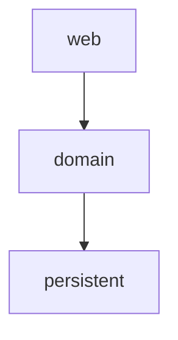
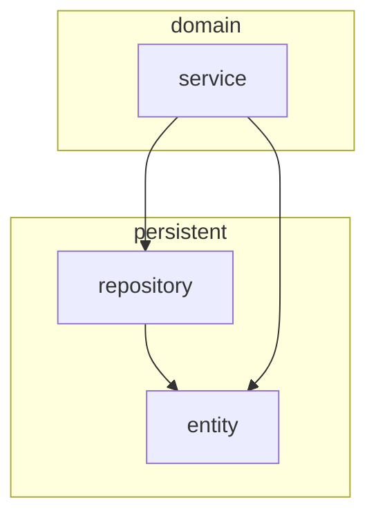
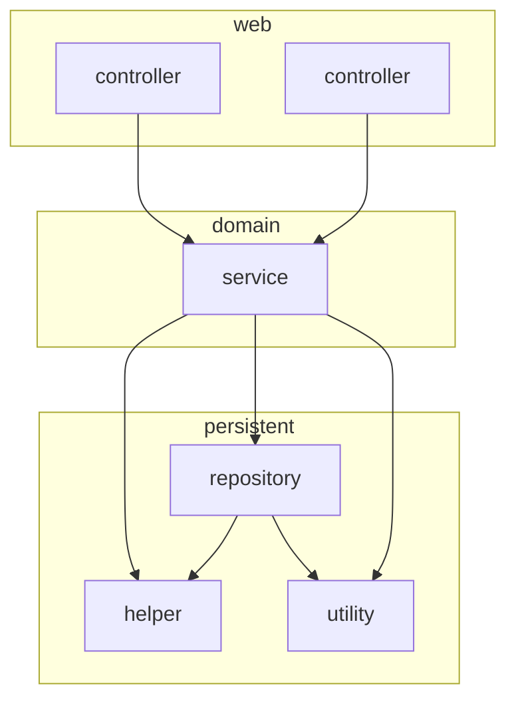

# 계층형 아키텍쳐의 문제

계층형 아키텍처는 데이터베이스 주도 설계를 유도한다.

계층형 아키텍쳐는 웹에서 요청을 받아 도메인/비즈니스 계층으로 요청을 보내고 필요한 로직을 수행한다. 도메인 엔티티의 현재 상태를 조회하거나 변경하기 위해 영속성 계층을 사용한다.

계층형 아키텍쳐

- 도메인 로직에 영향을 주지 않고 웹 계층과 영속성 계층의 기술을 변경할 수 있다.
- 변화하는 요구사항과 외부 요인에 빠르게 적응할 수 있게 해준다.

위와 같이 장점이 존재하지만 시간이 지날수록 소프트웨어를 점점 더 변경하기 어렵게 만든다.

- 웹 계층은 도메인 계층에 의존, 도메인 계층은 영속성 계층에 의존하게 되어 데이터 베이스에 의존하게 만든다.

애플리케이션의 목적

- 상태가 아닌 행동 중심 모델링
  - 행동이 상태를 바꾸게 되어 행동이 비즈니스를 이끌어 간다.

실제 유스케이스

- 도메인 로직보다 데이터베이스 구조를 먼저 생각하고 도메인 로직을 구현
  - 의존성 방향에 따라 구현한 것이기 때문에 계층형 아키텍처에서는 합리적
  - 비즈니스 관점에서는 맞지 않는 방법
- ORM (object-relational mapping) 프레임워크를 주로 사용하는 것이 원인
  - 계층형 아키텍처와 결합하면서 영속성 관점과 섞고 싶은 유혹을 받는다.

- 위와 같이 도메인 계층에서 엔티티에 접근하게 되면 강한 결합이 생긴다.
- 서비스는 도메인 로직 뿐 아니라 영속성 계층과 관련된 작업들을 해야만 한다.
- 특정 계층에서는 같은 계층에 있는 컴포넌트나 아래에 있는 계층에만 접근 가능하다.

테스트 하기 어려워 진다.

도메인 로직을 웹 계층에 구현하게 된다.

유스케이스가 확장된다면 책임이 섞이고 핵심 도메인 로직들이 퍼져나갈 확률이 높다.

테스트에서 도메인 계층 뿐 아니라 영속성 계층까지 모킹해야 한다.

- 단 하나의 필드를 조작하는 것에 불과하더라도 도메인 로직을 웹 계층에 구현하게 된다.

### 유스케이스를 숨긴다

기능을 추가하거나 변경할 적절한 위치를 찾는 일이 빈번하기 때문에 아키텍처는 코드를 빠르게 탐색하는 데 도움이 되어야 한다.

계층형 아키텍처

- 도메인 로직이 여러 계층에 걸쳐 흩어지기 쉽다.
- 도메인 계층과 영속성 계층 모두에서 접근할 수 있도록 특정 컴포넌트를 아래로 내렸다면 영속성 계층에 존재할 수도 있다
- 넓은 서비스는 영속성 계층에 많은 의존성을 갖게 되고 웹 레이어의 많은 컴포넌트가 이 서비스에 의존하게 된다.

### 동시 작업이 어려워 진다.

코드에 넓은 서비스가 존재하게 된다면 서로 다른 기능을 동시에 작업하기 더욱 어렵다.
