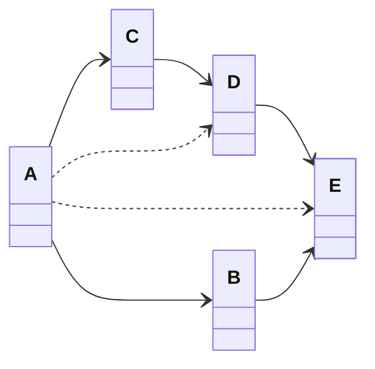
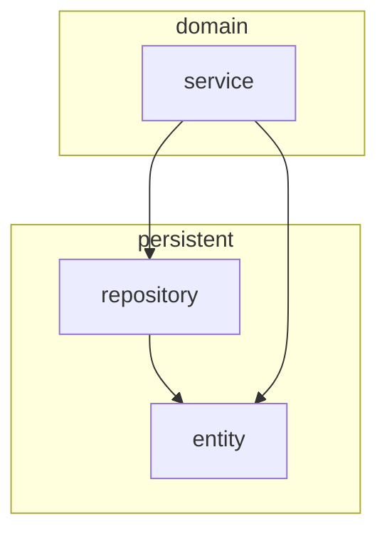
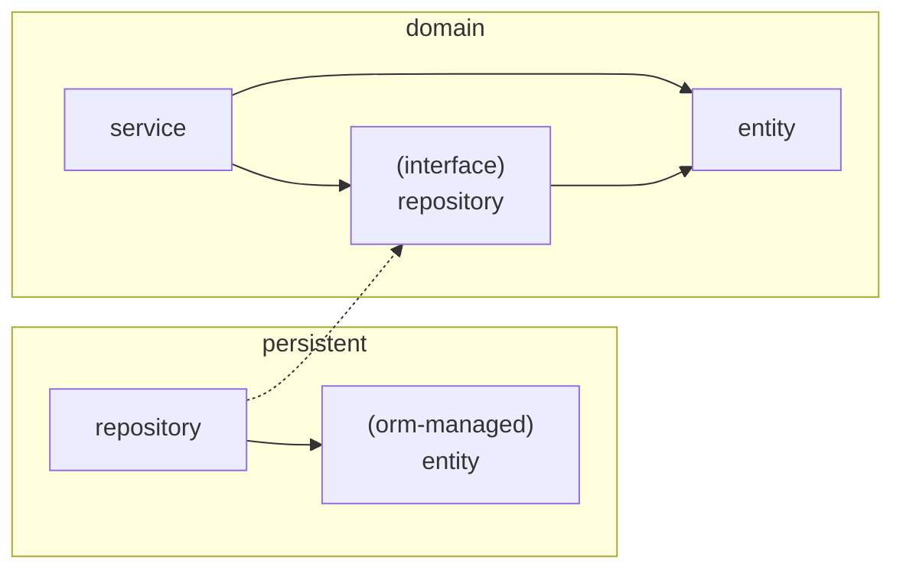

### 단일 책임 원칙

컴포넌트를 변경하는 이유는 오직 하나뿐이어야 한다.

- ‘책임’은 오로지 ‘한 가지 일만 하는 것’보다는 ‘변경할 이유’로 해석해야 한다.
- **컴포넌트를 변경할 이유가 한 가지라면 우리가 어떤 다른 이유로 소프트웨어를 변경하더라도 이 컴포넌트에 대해서는 전혀 신경 쓸 필요가 없다.**
  - 변경할 이유는 컴포넌트 간의 의존성을 통해 너무 쉽게 변질 될 수 있다.

- A 의 경우 모든 컴포넌트에 의존하고 있기 때문에 다른 어떤 컴포넌트가 변경되면 같이 변경이 된다.

> 하나의 기능 수정으로 다른 기능에 부수효과가 생길 수 있다. 부수효과가 무조건적으로 좋지 않은 것은 아니지만 예상치 못한 부수효과는 소프트웨어를 변경하기 힘들게 만들 수 있다.
> 이런 잘못된 부수효과를 유발하지 않도록 좋은 소프트웨어를 만들도록 노력하자

### 의존성 역전 원칙

**코드상의 어떤 의존성이든ㄷ 그 방향을 바꿀 수(역전시킬 수) 있다.**

- 의존성의 양쪽 코드를 모두 제어할 수 있는 경우만 의존성을 역전시킬 수 있다.

영속성 코드에 있는 의존성으로부터 도메인 로직을 해방 시켰다.

> 클린 아키텍쳐라는 용어에서 설계가 비즈니스 규칙의 테스트를 용이하게 하고, 비즈니스 규칙은 프레임워크, 데이터베이스, UI 기술, 그 밖의 외부 애플리케이션이나 인터페이스로부터 독립적일 수 있다고 한다.

계층들은 원으로 둘러싸여 있다.

- 가장 주요한 규칙은 의존성 규칙이며 계층 간의 모든 의존성이 안쪽으로 향해야 한다.
- 가장 안쪽인 코어에는 유스케이스에서 접근하는 도메인 엔티티들이 존재한다.
- 코어 주변으로는 비즈니스 규칙을 지원하는 다른 컴포넌트들이 있다.

도메인 코드에서는 어떤 영속성 프레임워크나 UI 프레임워크가 사용되는지 알 수 없어 특정 프레임워크에 의존하지 않으며 비즈니스 규칙에 집중할 수 있다.

**도메인 계층이 영속성이나 UI 같은 외부 계층과 철저하게 분리돼야 하므로 애플리케이션의 엔티티에 대한 모델을 각 계층에서 유지보수해야 한다.**

- 이는 도메인 코드를 프레임워크나 다른 계층에 종속적인 문제를 해방할 수 있어 바람직하다.
- Java Persistence API 에서는 ORM이 관리하는 엔티티에 인자가 없는 기본 생성자를 추가하도록 강제하는데 이는 도메인 모델에서는 포함해서는 안 될 프레임워크에 특화된 결합이 들어간다.

## 육각형 아키텍처 (헥사고날 아키텍처)

애플리케이션 코어가 육각형으로 표현되어 이 아키텍처의 이름이 되었다.

- **육각형에서 외부로 향하는 의존성이 없기 때문에 클린 아키텍처에서 제시한 의존성 규칙이 그대로 적용된다.**
- 왼쪽의 어댑터들은 애플리케이션을 주도한다. (주어댑터)
  - 포트가 코어에 있는 유스케이스 클래스 중 하나에 의해 구현되고 어댑터에 의해 호출되는 인터페이스가 된다.
- 오른쪽의 어댑터들은 애플리케이션에 의해 주도되는 어댑터들이다. (부어댑터)
  - 포트가 어댑터에 의해 구현되고 코어에 의해 호출되는 인터페이스가 된다.

> 위 개념으로 인해 이 아키텍처 스타일은 **포트와 어댑터** 아키텍처로도 알려져 있다.
