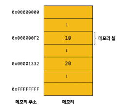
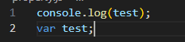
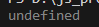
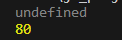

### 변수



메모리에 저장되는 모든 값은 2진수로 저장

- 메모리 주소를 통해 값을 직접 접근하는 것은 치명적인 오류를 발생시킬 가능성이 높은 매우 위험한 일이다.
    - 만약 운영체제가 사용하고 있는 값을 변경하면 시스템을 멈추게 할 수도 있다.
- 값이 저장될 메모리 주소는 코드가 실행될 때 메모리의 상황에 따라 임의로 저장된다.
    - 값이 저장될 메모리 주소는 코드가 실행될 때 메모리의 상황에 따라 임의로 결정된다.

**변수는 하나의 값을 저장하기 위해 확보한 메모리 공간 자체 또는 그 메모리 공간을 식별하기 위해 붙인 이름**

- 기억하고 싶은 값을 메모리에 저장하고, 저장된 값을 읽어 들여 재사용하기 위한 변수라는 메커니즘을 제공
- 값을 저장하고 참조하는 메커니즘으로 값의 위치를 가리키는 상징적인 이름.
- 컴파일러 또는 인터프리터에 의해 값이 저장된 메모리 주소로 치환되어 실행된다.
    - 개발자가 직접 메모리 주소를 통해 값을 저장하고 참조할 필요가 없고 변수를 통해 안전하게 값에 접근

변수명: 메모리 공간에 저장된 값을 식별할 수 있는 고유한 이름

변수 값: 변수에 저장된 값

할당: 변수에 값을 저장하는 것

참조: 변수에 저장된 값을 읽어 들이는 것

### 식별자

변수 이름을 식별자라고도 한다. **어떤 값을 구별해서 식별할 수 있는 고유한 이름**

- 식별자는 값이  저장되어 있는 메모리 주소와 매핑관계를 맺고 이 **매핑 정보도 메모리에 저장되어야 한다.**
- 식별자는 값이 아닌 메모리 주소를 저장하고 있다.
    - 식별자로 값을 구별해서 식별한다는 것은 식별자가 기억하고 있는 메모리 주소를 통해 메모리 공간에 저장된 값에 접근할 수 있다는 의미
    - 메모리 주소에 붙인 이름


**변수, 함수, 클래스 등의 이름은 모두 식별자이다.**

### 변수 선언

값을 저장하기 위한 메모리 공간을 확보

변수 이름과 확보된 메모리 공간의 주소를 연결해서 값을 저장할 수 있게 준비하는 것

확보된 메모리 공간은 확보가 해제되기 전까지 누구도 확보된 메모리 공간을 사용할 수 없도록 보호되므로 안전하게 사용 가능

**변수를 사용하려면 반드시 선언이 필요하며 변수를 선언할 때 var, let, const 키워드를 사용한다.**

> keyword
키워드는 자바 스크립트 코드를 해석하고 실행하는 자바스크립트 엔진이 수행할 동작을 규정한 일종의 명령어. 키워드를 만나면 자신이 수행해야 할 약속된 동작을 수행
> 

자바 스크립트 엔진은 변수선언을 2단계에 걸쳐 수행

1. 선언단계: 변수 이름을 등록해서 자바스크립트 엔진에 변수의 존재를 알린다.
2. 초기화 단계: 값을 저장하기 위한 메모리 공간을 확보하고 암묵적으로 undefined를 할당해 초기화

> 변수 이름과 모든 식별자는 실행 컨텍스트에 등록된다.
실행 컨텍스트(Execution Context)
자바스크립트 엔진이 소스코드를 평가하고 실행하기 위해 필요한 환경을 제공하고 코드의 결과를 실제로 관리하는 영역.
실행 컨텍스트를 통해 식별자와 스코프를 관리
> 

var 키워드를 사용한 변수 선언은 선언 단계와 초화 단계가 동시에 진행. var 키워드는 초기화 단계를 거칠 때 암묵적으로 undefined로 초기화가 자동 수행

초기화 단계를 거치지 않으면 이전에 다른 애플리케이션이 사용했던 값이 남아 있을 수 있고 (쓰레기 값이라 한다.) 값을 할당하지 않으면 참조할 때 쓰레기 값이 나올 수 있다.

- 모든 식별자를 사용하려면 반드시 선언이 필요하다.
    - 선언하지 않은 식별자에 접근하면 ReferenceError(참조에러)가 발생한다.
    - ReferenceError는 식별자를 통해 값을 참조하려 했지만 자바스크립트 엔진이 등록된 식별자를 찾을 수 없을 때 발생하는 에러

### 변수 선언 실행 시점과 변수 호이스팅





자바스크립트는 인터프리터 언어로 한 줄씨 순차적으로 실행되어 변수 선언문보다 변수를 먼저 참조하고 있어 ReferenceError가 발생할 것처럼 보이지만 참조에러가 발생하지 않고 undfined가 출력된다.

**변수 선언이 소스코드가 한 줄씩 순차적으로 실행되는 시점, 즉 런타임이 아니라 그 이전 단계에서 먼저 실행된다.**

자바스크립트 엔진은 소스코드의 평가와 소스코드의 실행 과정으로 나누어 처리

소스코드를 한 줄씩 실행하기 전에 먼저 소스코드의 평가 과정을 거치면서 소스코드를 실행하기 위한 준비

소스코드의 평가과정이 끝나면 변수선언을 포함한 모든 선언문을 제외하고 소스코드를 한 줄씩 순차적으로 실행한다.

**변수 선언문이 코드의 선두로 끌어 올려진 것처럼 동작하는 자바스크립트의 고유의 특징을 호이스팅 (variable hoisting)**

- 모든 식별자는 호이스팅 된다.

### 값의 할당

변수에 값을 할당(대입, 저장)할 때는 할당 연산자 ‘=’을 사용

**변수 선언은 소스코드가 순차적으로 실행되는 시점인 런타임 이전에 먼저 실행되지만 값의 할당은 소스코드가 순차적으로 실행되는 시점인 런타임에 실행된다.**

```jsx
console.log(score);

var score;
score = 80;

console.log(score);
```



변수의 선언과 할당을 하나의 문으로 단축 표현해도 자바 스크립트 엔진은 변수의 선언과 값의 할당을 2개의 문으로 나누어 각각 실행한다.

### 값의 재할당

이미 값이 할당되어 있는 변수에 새로운 값을 또다시 할당하는 것

- var 키워드로 선언한 변수는 선언과 동시에 undefined로 초기화되기 때문에 변수에 처음으로 값을 할당하는 것도 사실은 재할당이다.

**값을 재할당할 수 없어 변수에 저장된 값을 변경할 수 없다면 변수가 아니라 상수라 한다.**

변수에 값을 재할당하면 메모리 공간을 지우고 그 공간에 값을 새로 저장하는 것이 아닌 새로운 메모리 공간을 확보하고 그 메모리 공간에 값을 저장한다.

어떤 식별자와도 연결되어 있지 않은 메모리는 가비지 컬렉터에 의해 메모리에서 자동으로 해제된다