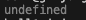

# 5장 표현식과 문

### 값

**값은 식(표현식, expression)이 평가(evaluate)되어 생성된 결과**

### 리터럴

**사람이 이해할 수 있는 문자 또는 약속된 기호를 사용해 값을 생성하는 표기법**

자바 스크립트 엔진은 코드가 실행되는 시점인 **런타임에 리터럴을 평가**해 값을 생성한다.

소스코드의 고정된 값을 나타내는 표기법

### 표현식

값으로 평가될 수 있는 문. 표현식이 평가되면 새로운 값을 생성하거나 기존 값을 참조한다.

- 리터럴은 자바스크립트 엔진에 의해 평가되어 값을 생성하므로 표현식이다.

```jsx
var score = 50 + 50;
score;
```

- 50 + 50은 리터럴과 연산자로 이루어져 있다. 50 + 50도 평가되어 숫자 100을 생성하므로 표현식이다.
- 변수 식별자를 참조하면 변수 값으로 평가된다.
    - 식별자 참조는 값을 생성하지 않지만 값으로 평가되므로 표현식이다.
- 표현식은 리터럴, 식별자(변수, 함수 등의 이름), 연산자, 함수 호출 등의 조합으로 이루어질 수 있다.
- 문법적으로 값이 위치할 수 있는 자리에는 표현식도 위치할 수 있다.

```jsx
var x = 1 + 2;
x + 3
```

- x는 할당되어 있는 숫자 3으로 평가된다.
    - 숫자 값이 위치해야 할 자리에 표현식 x를 사용할 수 있다.
    - 다른 표현식의 일부가 되어 새로운 값을 만들어 낼 수 있다.

### 문

프로그램을 구성하는 기본 단위이자 최소 실행 단위

- 문의 집합으로 이뤄진 것이 프로그램이고 문을 작성하고 순서에 맞게 나열하는 것이 프로그래밍

문은 여러 토큰으로 구성된다.

- 토큰(token): 문법적인 의미를 가지며, 문법적으로 더 이상 나눌 수 없는 코드의 기본 요소
    - 키워드, 식별자, 연산자, 리터럴, 세미콜론, 마침표 등 특수한 기호는 문법적 의미를 가지고 문법적으로 더 이상 나눌 수 없는 기본요소이므로 토큰이다.

### 세미콜론과 세미콜론 자동 삽입기능

세미콜론(;)은 문의 종료를 나타낸다.

- 0개 이상의 문을 중괄호로 묶은 코드블로({…}) 뒤에는 세미콜론을 붙이지 않는다.
    - if문, for문, 함수 등
    - 이런 코드 블록은 언제나 문의 종료를 의미하는 자체 종결성(self closing)을 갖기 때문

자바스크립트 엔진은 세미콜론 자동 삽입 기능(ASI, Automatic Semicolon Insertion)이 암묵적으로 수행

- 세미콜론 자동 삽입 기능의 동작과 개발자의 예측이 일치하지 않는 경우가 간혹있다.

```jsx
function foo () {
	return
		{}
}

console.log(foo());
```



```jsx
var bar = function() {}
(function() {})();
```


자바스크립트에서는 function을 정의한 후 바로 인자를 넣어줄 수 있다.

즉, 위의 (function() {})() 에서 (function(){}) 은 var bar = function() {} 의 함수 실행의 매개변수가 되는 것이다. 그런데 매개변수가 없는데 function() {}을 넣어주려고 하니 TypeError가 발생한 것이다.

```jsx
var bar = function(str) {
    console.log(str)
} (function(str){
    console.log("second" + str);
    return "hi";
}("hello"));
```


위와 같이 매개변수로 function을 넣어주는 것을 확인할 수 있고 매개변수가 있고 이에 함수를 넣어주므로 TypeError 가 따로 발생하지 않는 것을 볼 수 있다.

### 표현식인 문과 표현식이 아닌 문

표현식은 문의 일부일 수도 있고 그 자체로 문이 될 수 있다.

```jsx
var x;
x = 1 + 2;
```

- var x: 변수 선언문은 값으로 평가될 수 없으므로 표현식이 아니다. (문)
- 1, 2, 1 + 2, x = 1 + 2 는 모두 표현식이다.
- x = 1 + 2 는 표현식이면서 완전한 문이다.

표현식과 문을 구분하는 방법

- 표현식인 문은 값으로 평가될 수 있는 문이다.
    - 할당문은 값으로 평가될 수 있다. (표현식인 문)
- 표현식이 아닌 문은 값으로 평가될 수 없는 문을 말한다.
- **표현식인 문과 표현식이 아닌 문을 구별하는 가장 간단하고 명료한 방법은 변수에 할당해 보는 것**

> 완료값
크롬 개발자 도구에서 표현식이 아닌 문을 실행하면 undefined를 출력하는데 이를 완료값이라고 한다.
완료값은 표현식의 평가 결과가 아니므로 다른 값과 같이 변수에 할당할 수 없고 참조할 수 없다.
표현식인 문을 실행하면 언제나 평가된 값을 반환한다.
> 


var test = 10 자체는 문이므로 변수에 할당할 수 없다. (var a = var test = 10 ⇒ X)

