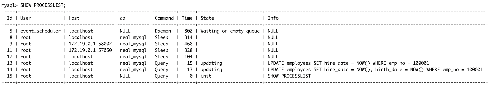
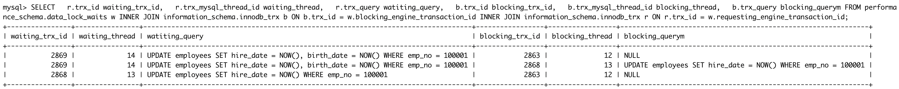

## 인덱스와 잠금

InnoDB의 잠금은 레코드를 잠그는 것이 아닌 인덱스를 잠그는 방식으로 처리된다. <br />
변경해야 할 레코드를 찾기 위해 인덱스의 레코드를 모두 락을 걸어야 한다.

```SQL
-- // first_name 에만 인덱스가 걸려있다.
SELECT COUNT(*) FROM employee WHERE first_name = 'Georgi';
-- // 253

SELECT COUNT(*) FROM employee WHERE first_name = 'Georgi' AND last_name = 'Klassen';
-- // 1

UPDATE employee SET hire_date = NOW() WHERE first_name = 'Georgi' AND last_name = 'Klassen';
```

UPDATE 문이 실행되면 인덱스가 걸린 first_name = Georgi 인 레코드가 모두 잠긴다. <br />
인덱스가 하나도 없다면 테이블을 풀 스캔하면서 UPDATE 작업을 하는데 테이블의 모든 레코드를 잠그게 된다.

## 잠금 확인 및 해제

**잠금 시나리오**

Connection 1

```SQL
BEGIN;
UPDATE employees
SET birth_date = NOW()
WHERE emp_no = 100001;
```

Connection 2

```SQL
UPDATE employees
SET hire_date = NOW()
WHERE emp_no = 100001;
```

Connection 3

```SQL
UPDATE employees
SET hire_date = NOW(), birth_date = NOW()
WHERE emp_no = 100001;
```



> MySQL 5.1 에서는 information_schema 테이블을 통해 INNODB_LOCKS, INNODB_LOCK_WAITS 를 확인 가능 하였지만
> 8.0 부터는 information_schema의 정보들은 제거 되고 있으면 performance_schema 의 data_locks 와 data_lock_waits 테이블로 대체되고 있다.

12 번 쓰레드(Id)는 업데이트를 하고 Commit 을 실행하지 않은 상태이다.

13, 14 번 쓰레드(Id)는 아직 UPDATE 명령 이후 실행중인 것으로 표시되어 있다.

```SQL
SELECT
  r.trx_id waiting_trx_id,
  r.trx_mysql_thread_id waiting_thread,
  r.trx_query watiting_query,
  b.trx_id blocking_trx_id,
  b.trx_mysql_thread_id blocking_thread,
  b.trx_query blocking_querym
FROM performance_schema.data_lock_waits w
INNER JOIN information_schema.innodb_trx b ON b.trx_id = w.blocking_engine_transaction_id
INNER JOIN information_schema.innodb_trx r ON r.trx_id = w.requesting_engine_transaction_id;
```



13, 14번 쓰레드가 대기 중인 것을 볼 수 있다.
13 번 쓰레드는 12번 쓰레드를 기다리고 있고 14번 쓰레드는 12, 13번 쓰레드를 기다리고 있다.

> 더 자세히 보고 싶다면 performance_schema 의 data_locks 테이블이 가진 칼럼을 확인하면 된다.
> select \* from performance_schema.data_locks/G
