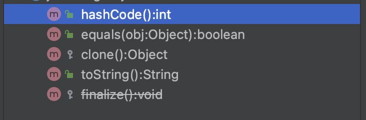

# Item 8 - finalizer 와 cleaner 사용을 피하라

## finalizer

### finalize 메세드란

최상위 클래스인 Object 클래스에서 사용한 메서이다. 자바 8의 문서를 확인해 보면([https://docs.oracle.com/javase/8/docs/api/java/lang/Object.html](https://docs.oracle.com/javase/8/docs/api/java/lang/Object.html))

<aside>
💡 Called by the garbage collector on an object when garbage collection determines that there are no more references to the object. A subclass overrides the `finalize` method to dispose of system resources or to perform other cleanup.
객체에 참조가 더 이상 없다고 판단될 때 가비지 컬렉터가 호출하는 메서드이다. 하위 클래스에서 finalize 메서드 오버라이딩을 통해 시스템 리소스나 다른 정리를 수행하기 위해 재정의 할 수 있다.

</aside>

즉 finalize는 객체가 소멸될 때 호출되기로 약속된 메서드이다. finalizer 는 

자바 버전 9부터는 finalize 메서드는 deprecated 되었다.



현재 자바 11버전에서는 deprecated 되어있어 취소선이 그어져 있다.

```java
public class Finalizable {
    private BufferedReader reader;

    public Finalizable() {
        InputStream input = this.getClass()
                .getClassLoader()
                .getResourceAsStream("file.txt");

        this.reader = new BufferedReader(new InputStreamReader(input));
    }

    public String readFirstLine() throws IOException {
        String firstLine = reader.readLine();
        return firstLine;
    }
}
```

```java
@Override
protected void finalize() throws Throwable {
    try {
        reader.close();
        System.out.println("Closed BufferedReader in the finalizer");
    } catch (Exception e) {
        e.printStackTrace();
    }
}
--------------------------------------------------------------------------------
System.gc();
```

가비지 컬렉터가 Finalizable 객체 참조가 더 이상 없다고 판단되면 finalize 메서드를 호출하여 reader.close 가 실행되고 file.txt 파일에 대한 리소스가 해제된다.

혹은 사용자가 System.gc(); 를 호출해 가비지 컬렉터가 사용하지 않는 객체들을 정리하도록 하게한다. 하지만 모든 사용하지 않는 객체에 대해 정리가 이루어지지 않고 성능이 저하된다.

---

## Cleaner

### Cleaner 란?

finalize의 대안으로 나온 객체 소멸자이다.

```java
public class CleanerTest {
    public static void main(String[] args) {
        Cleaner cleaner = Cleaner.create();

        if(true) {
            CleanerTest object = new CleanerTest();
            cleaner.register(object, new State());
        }

        for(int i=0; i<10000; i++) {
            String[] largeObject = new String[1000];
            try {
                Thread.sleep(1);
            } catch (InterruptedException e) {
                e.printStackTrace();
            }
        }
    }

    public static class State implements Runnable {

        @Override
        public void run() {
            System.out.println("Cleaning action");
        }
    }
}
```

Cleaner 객체를 만들고 소멸시킬 자원이나 객체를 쓰레드로 소멸되게 만들어 cleaner 에 등록하게 되면 (cleaner.register(object, new State()) ) 가비지 컬렉터가 참조되지 않은 자원이나 객체를 회수해 간다.

위의 코드를 실행시켜 보면 몇초뒤 State 클래스의 run 함수가 실행쇠어 Cleaning action 이 콘솔에 찍히는 것을 확인 할 수 있다.

---

## finalizer와 cleaner 사용을 피하라

finalize 와 cleaner 에 대해 간단히 알아 보았으므로 아이템 8의 내용으로 넘어가 보자.

### 1. finalizer 는 예측할 수 없고, 상황에 따라 위험할 수 있어 일반적으로 불필요하다.

finalizer 는 쓰임새가 있지만 기본적으로는 쓰지 말아야 한다. 그래서 자바 버전 9에서는 deprecated 로 정하고 cleaner 가 그 대안으로 나왔다.

하지만 일부 자바 라이브러리에서는 finalizer 를 여전히 사용한다.

### 2. cleaner 는 finalizer 보다는 덜 위험하지만, 여전히 예측할 수 없고, 느리고, 일반적으로는 불필요하다.

C++ 에서는 destructor라는 파괴자라는 개념이 있다. C++ 에서 파괴자는 생성자의 대척점으로 특정 객체와 관련된 자원을 회수하는 보편적인 방법이다.

자바에서는 접근할 수 없게 된 객체를 회수하는 역할을 가비지 컬렉터가 담당하기 때문에 자원을 회수하기 위해서 try-with-resource 와 try-finally를 사용해 해결한다.

### 3. finalizer와 cleaner로는 제때 실행되어야 하는 작업은 절대 할 수 없다.

finalizer와 cleaner는 즉시 수행된다는 보장이 없다. 객체에 접근할 수 없게 된 후 finalizer나 cleaner 가 실행되기 까지 얼마나 걸릴지 알 수없다.

시스템은 동시에 열 수 있는 파일 개수에 한계가 있다. 만약 시스템이 리소스를 여러개 열어두고 finalizer나 cleaner 에게 리소스 회수를 맡길때 언제 리소스를 회수되는지 알 수 없고 리소스 회수가 지연되어 새로운 파일을 열지 못해 프로그램이 실패 할 수 있다.

finalizer와 cleaner 가 얼마나 빨리 수행되는지는 가비지 컬렉터의 알고리즘에 따라 달라 가비지 컬렉터의 구현마다 수행 시간이 천차만별이다. 따라서 개발자가 수행한 JVM 에서는 완벽하게 동작했다 하더라도 사용자의 시스템에서는 제대로 동작하지 않는 문제가 발생할 수 있다.

### 4. 상태를 영구적으로 수정하는 작업에서는 절대 finalizer나 cleaner에 의존해서는 안 된다.

finalizer와 cleaner의 수행 시점뿐만 아니라 수행 여부조차 보장해주지 않는다. 즉 접근할 수 없는 객체가 가진 종료 작업을 전혀 수행하지 못한 채 프로그램이 중단될 수 있다.

데이터 베이스와 같은 공유자원의 영구 락(lock) 해제를 finalizer나 cleaner에게 맡기면 분산 시스템 전체가 서서히 멈추는 상황이 나올 수 있다.

- 데이터베이스 lock
    
    [https://sabarada.tistory.com/121](https://sabarada.tistory.com/121)
    

System.gc 나 System.runFinalization 메서드는 가비지 컬렉션을 수행하거나 finalize를 메서드를 수행시키 하여 finalizer와 cleaner 가 실행될 가능성을 높여줄 수 있지만 보장해주지는 않는다.

finalizer에서 발생된 예외는 무시되고 처리할 작업이 남아있더라도 그 순간 종료되고 경고조차 출력해 주지 않는다. cleaner 의 경우 자신의 스레드를 통제하기 때문에 이러한 문제가 발생되지 않는다.

### 5. finalizer와 cleaner는 심각한 성능 문제를 동반한다.

### 6. finalizer를 사용한 클래스는 finalizer 공격에 노출되어 심각한 보안 문제를 일으킬 수도 있다.

생성자나 직렬화 과정(readObject, readResolve)에서 예외가 발생하면, 생성되다 만 객체에서 악의적인 하위 클래스의 finalizer가 수행될 수 있게 된다. 

### finalizer attack

finalizer 메서드에서도 자바 코드가 실행 될 수 있어 가비지 컬렉터의 대상이 안되게 할 수 있다.

```java
public class Zombie {
    int value = 0;

    Zombie(int value) {
        if(value <= 0) {
            throw new IllegalArgumentException("Zombie value");
        }
        this.value = value;
    }
}
```

```java
public class AttackZombie extends Zombie {
    static Zombie zombie;

    public AttackZombie(int value) {
        super(value);
    }

    @Override
    protected final void finalize() throws Throwable {
        zombie = this;
    }

    public static void main(String[] args) {
        try {
            AttackZombie attackZombie = new AttackZombie(-1);
        } catch (Exception e) {
            e.printStackTrace();
        }

        System.gc();
        System.runFinalization();
        if(zombie != null) {
            System.out.println("zombie attack " + zombie + " success");
        }
    }
}
```


위 코드를 실행시켜 보면 System.gc() 와 System.runFinalization() 을 실행시킨다 하더라도 zombie 객체가 static 으로 살아있는 것을 볼 수 있다.

finalizer 공격을 피하는 방법으로 생성자에 예외를 던져 객체 생성을 막거나 finalize 메서드를 final 로 만들고 아무일도 하지 않게 만들면 된다.

1. 생성자에서 예외 던져 객체생성을 못하게 막기

```java
public class Zombie {
    int value = 0;

    private Zombie(Void checkValue){}

    Zombie(int value) {
        this(checkValues(value));
        this.value = value;
    }

    static Void checkValues(int value) {
        if (value <= 0) {
            throw new IllegalArgumentException("Invalid value");
        }
        return null;
    }
}
```

1. finalize 메서드를 final로 만들고 아무일도 하지 않게 만들기

```java
@Override
protected final void finalize() throws Throwable {
}
```

---

## finalizer와 cleaner 의 쓰임새

1. 자원의 소유자가 close 메서드를 호출하지 않은 것에 대비한 안전망 역할.
cleaner 나 finalizer 가 즉시 호출된다는 보장은 없지만 늦게라도 자원회수를 해 주는 것이 안해주는 것보단 낫다.
2. 네이티브 피어(native peer)와 연결된 객체를 회수하기 위해 사용. 네이티브 피어란 일반 자바 객체가 네이티브 메서드를 통해 기능을 위임한 네이티브 객체를 말한다. 네이티브 피어는 자바 객체가 아니기 때문에 가비지 컬렉터는 그 존재를 알지 못하고 자바 피어를 회수할 때 네이티브 객체까지 회수하지 못한다. 이때 finalizer와 cleaner가 처리하기에 적당하다.
이 때 네이티브 피어가 심각한 자원을 가지고 있지 않거나 성능 저하를 감당할 수 있을 때만 해당된다. 자원을 즉시 회수해야 한다면 close 메서드를 사용해야 한다. (AutoCloseable를 구현해 close 메서드를 구현)

---

## AutoCloseable

```java
public class Room implements AutoCloseable {
    private static final Cleaner cleaner = Cleaner.create();
    
    private static class State implements Runnable {
        int numJunPiles;
        
        State(int numJunPiles) {
            this.numJunPiles = numJunPiles;
        }

        @Override
        public void run() {
            System.out.println("방 청소");
            numJunPiles = 0;
        }
    }
    
    private final State state;
    
    private final Cleaner.Cleanable cleanable;
    
    public Room(int numJunPiles) {
        state = new State(numJunPiles);
        cleanable = cleaner.register(this, state);
    }
    
    @Override
    public void close() throws Exception {
        cleanable.clean();
    }
}
```

- static 으로 선언된 State 클래스는 cleaner 가 방을 청소할 때 수거할 자원들을 가지고 있다.
- numJunPiles가 수거할 자원
- 더 현실적으로 만들려면 이 필드는 네이티브 피어를 가리키는 포인터를 담은 final long 변수여야한다.
- State는 Runnable을 구현해 run 메서드는 cleanable에 의해 딱 한번 호출된다. run 메서드가 호출되는 상황은 둘 중 하나인데 보통 Room 의 close 메서드를 사용할 때와 가비지 컬렉터가 Room 을 회수할 때까지 클라이언트가 close 를 호출하지 않는다면, cleaner가 State의 run 메서드를 실행 시켜준다.

State 인스턴스는 절대로 Room 인스턴스를 참조해서는 안된다. Room 인스턴스를 참조하는 경우 순환참조가 생겨 가비지 컬렉터가 Room 인스턴스를 회수해갈 기회가 오지 않는다.

try-with-resource를 이용해 close 메서드를 호출할 필요없이 자원을 정리할 수 있다.

```java
public static void main(String[] args) throws IOException {
    try (Room room = new Room(7)) {
        System.out.println("안녕");
    } catch (Exception e) {
        e.printStackTrace();
    }
}
```

---

> 정리
> 

<aside>
💡 cleaner(자바 8까지는 finalizer)는 안전망 역할이나 중요하지 않은 네이티브 자원 회수용으로만 사용하자. 물론 이 경우라도 불확실성과 성능 저하에 주의해야 한다.

</aside>

---

> 참고
> 

[https://www.baeldung.com/java-finalize](https://www.baeldung.com/java-finalize)

[https://www.tutorialspoint.com/what-is-the-use-of-the-cleaner-class-in-java-9](https://www.tutorialspoint.com/what-is-the-use-of-the-cleaner-class-in-java-9)

[https://yangbongsoo.tistory.com/8](https://yangbongsoo.tistory.com/8)