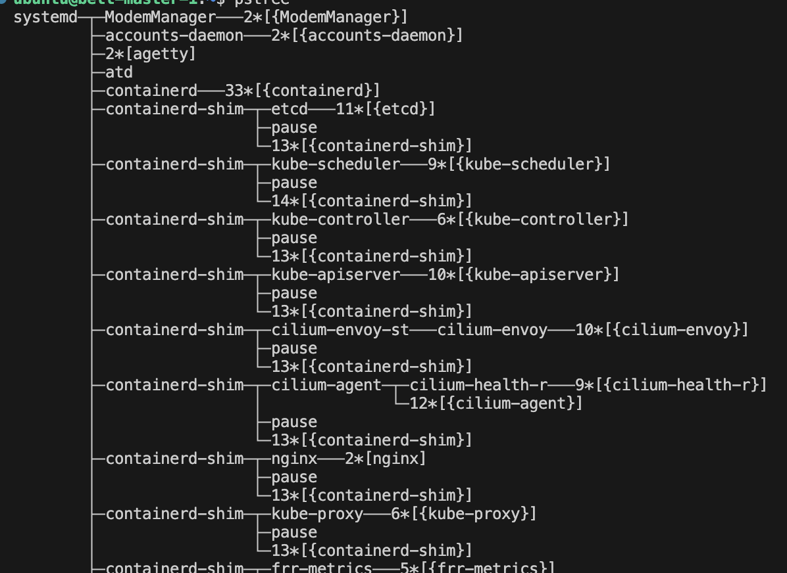
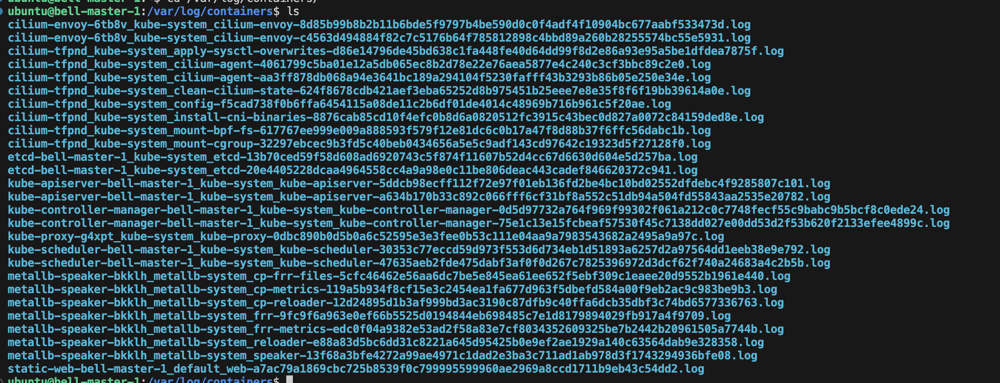

## 애플리케이션 로그 관리

### Kubernetes 애플리케이션 로그 확인

- 로그는 컨테이너 단위로 로그 확인 가능
- 싱글 컨테이너 포드의 경우 포드까지만 지정하여 로그 확인
- 멀티 컨테이너의 경우 포드 뒤에 컨테이너 이름까지 전달하여 로그확인

### kubeapi 가 정상 동작하지 않는 경우

마스터 서버와 통신이 두절, 네트워크, 물리적 다운, certificate 만료, static pod argument 를 잘못 주어 부팅 에러 등의 상황으로 kubeapi 가 동작하지 않을 수 있음

- 쿠버네티스에서 돌아가는 리소스들은 모두 docker 를 사용
  - docker 의 로깅 기능을 사용

### 로그 확인

```bash
journalctl -u kubelet -f
```

journalctl 을 사용하면 kubelet의 내용을 확인할 수 있음

```bash
pstree
```



containerd 하위에 shim 이 있으며 여러 시스템들이 실행되고 있음

- docker 에 로그가 쌓이게 된다.
  - `/var/log/containers` 하위에 로그가 쌓임




- {pod}_{namespace}_{container name}.log 형태로 저장된다.
