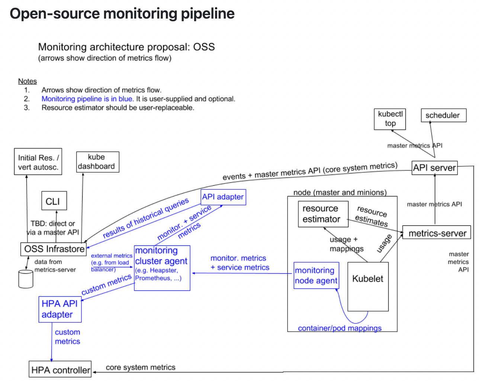
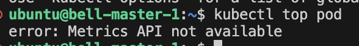
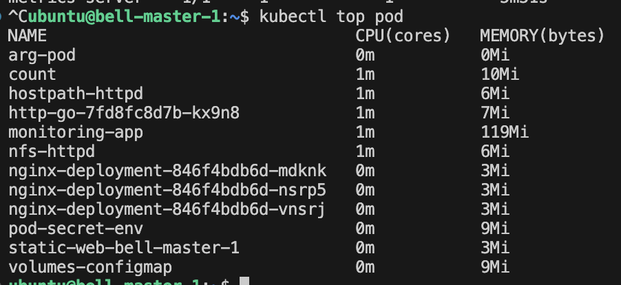

## **클러스터 컴포넌트 모니터링**

> prometheus, ELK 의 내용은 매우 방대하므로 여기서는 간단히 모니터링을 어떻게 할 수 있는지 방법만 확인

### **k8s 모니터링 시스템 아키텍쳐**

### 모니터링 서비스 플랫폼

- Heapster
  - deprecate 된 상태이다.
- Metric Service, cAdvisor
  - kubelet의 서비스를 모니터링
  - 위 두 플랫폼으로 k8s가 모니터링
- prometheus, ELK
  - 하나의 프로젝트들이며 위 플랫폼으로 보다 좋게 k8s 를 운영할 수 있게 해준다.

cluster node 사용량 및 pod 사용량 확인

```Bash
kubectl top node
```

### 리소스 모니터링 도구

- 쿠버네티스 클러스터 내의 애플리케이션 성능을 검사
- 각 레벨에서 애플리케이션 리소스 사용량에 대한 상세 정보를 제공
- 애플리케이션의 성능을 평가하고 병목 현상을 제거하여 전체 성능 향상을 도모
- 리소스 메트릭 파이프라인
  - kubectl top 등의 유틸리티 관련된 메트릭들로 제한된 집합을 제공
  - 단기 메모리 저장소인 metrics-server 에 의해 수집
  - metric-server 는 모든 노드를 발견하고 kubelet 에 의해 수집
  - kubelet은 kubelet에 통합된 cAdvisor를 통해 레거시 도커와 통합 후 metric-server 리소스 메트릭으로 노출
    - kubectl 이 k8s API 서버에 요청하고 k8s API 서버는 metrics-service에 질의를 요청한다. metrics-service 는 kubelet 에 요청하고 kubelet 은 하위 cAdvisor docker 에 요청하여 데이터를 가져오게 된다.
    - /metrics/resource/v1beta1 API를 사용
- 완전한 메트릭 파이프라인
  - 보다 풍부한 메트릭에 접근
  - 클러스터의 현재 상태를 기반으로 자동으로 스케일링하거나 클러스터를 조정
  - 모니터링 파이프라인은 kubelet에서 메트릭을 가져옴
  - CNCF 프로젝트인 프로메테우스가 대표적
  - `custom.metrics.k8s.io`, `external.metrics.k8s.io` API 를 사용

### Monitoring architecture

https://github.com/kubernetes/design-proposals-archive/blob/main/instrumentation/monitoring_architecture.md



- HPA 는 Monitoring Cluster 에서 메트릭을 받아 오토스케일링이 가능

## Metrics-server 설치

metrics service 가 있어야 `kubectl top pod` 명령이 가능



```Bash
kubectl apply -f https://github.com/kubernetes-sigs/metrics-server/releases/latest/download/components.yaml
```

설치는 하였지만 tls 통신이 되지 않아 Metric 정보를 아직 가져올 수 없음

- 원래는 certificate 와 개인키가 필요

무시하는 방식으로 설정

```Bash
kubectl edit deploy -n kube-system metrics-server
```

arguement 에 전달

```Yaml
spec:
  containers:
  - args:
    - --kubelet-insecure-tls
    - --kubelet-preferred-address-types=InternalIP
```

—kubelet-insecure-tls

- 인증서가 공인 기관에 승인 받지 않은 안전하지 않기 때문에 보안적으로 취약하지만 무시

—kubelet-preferred-address-types=InternalIP

- kubelet 연결에 사용할 때 사용하는 주소 타입을 지정

`kubectl top pod`


