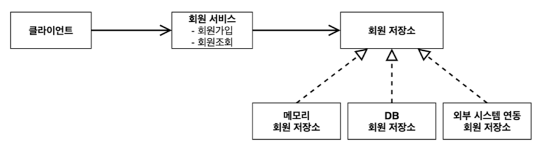

# 예제 만들기

## 비즈니스 요구사항과 설계

### 1. 회원

- 회원을 가입하고 조회할 수 있다.
- 회원은 일반과 VIP 두 가지 등급이 있다.
- 회원 데이터는 자체 DB를 구축할 수 있고, 외부 시스템과 연동할 수 있다.(미확정)

### 2. 주문과 할인 정책

- 회원은 상품을 주문할 수 있다.
- 회원 등급에 따라 할인 정책을 적용할 수 있다.
- 할인 정책에서 모든 VIP는 1000원을 할인해 주는 고정 금액 할인을 적용(변경 가능)
- 할인 정책은 변경 가능성이 높다. 최악의 경우 할인을 적용하지 않을 수도 있다(미확정)

위의 요구사항들을 보면 변경이 일어날 수 있는 부분이 있다. 객체지향 설계 방법을 이용해 인터페이스를 만들고 구현체를 언제든지 변경할 수 있게 설계하면 결정될 때까지 개발을 기다리지 않고 바로 개발을 진행 할 수 있다.

> 지금은 스프링이 없는 순수한 자바로만 개발을 진행한다!!
> 

## 회원 도메인 설계

### 요구사항

- 회원을 가입하고 조회할 수 있다.
- 회원은 일반과 VIP 두 가지 등급이 있다.
- 회원 데이터는 자체 DB를 구축할 수 있고, 외부 시스템과 연동할 수 있다.(미확정)

### 회원 도메인 협력 관계

- 기획자도 보는 그림, 도메인 협력관계를 기반으로 클래스 다이어그램을 그린다.



요구사항을 보면 아직 회원 DB가 미확정으로 되어있어 회원저장소라는 역할을 만들고 메모리 회원 저장소, DB 회원 저장소, 외부 시스템 연동 회원 저장소로 구현을 나누어 구현 할 것이다. → 역할과 구현을 나눔

### 회원 클래스 다이어그램

- 실제 구현 레벨로 내려와 클래스, 인터페이스 명세를 작성
- 클래스 간의 의존관계, 연관관계, 제약조건 등을 기반으로 개발


먼저 MemberService 인터페이스를 만들어 역할을 생성하고 MemberServiceImple 클래스로 구현을 해준다. 그리고 MemberRepository 인터페이스는 회원 저장소의 역할이고 이에 대한 구현체로 메모리 회원 저장소인 MemoryMemberRepository, DB 회원 저장소인 DbMemberRepository 클래스를 구현 해준다.

### 회원 객체 다이어 그램

- 런타임에서 객체가 생성됬을 때 시나리오를 다이어그램으로 그림


회원 객체 다이어그램은 객체 간 메모리 참조관계를 나타낸다. 클라이언트는 회원서비스를, 회원서비스는 메모리 회원 저장소를 바라보게 된다.

---

## 회원 도메인

### 1. 회원 등급

```java
public enum Grade {
    BASIC, VIP
}
```

회원의 등급을 설정하기 위해 Grade라는 enum 타입을 생성해 준다.

### 회원 엔티티

```java
public class Member {
    private Long id;
    private String name;
    private Grade grade;

    public Member(Long id, String name, Grade grade) {
        this.id = id;
        this.name = name;
        this.grade = grade;
    }

    public Long getId() {
        return id;
    }

    public void setId(Long id) {
        this.id = id;
    }

    public String getName() {
        return name;
    }

    public void setName(String name) {
        this.name = name;
    }

    public Grade getGrade() {
        return grade;
    }

    public void setGrade(Grade grade) {
        this.grade = grade;
    }
}
```

회원 객체를 생성하기 위해 Member 라는 이름의 클래스를 구현했다.

> intellij 에서 command + n 키를 누르면 빠르게 getter 와 setter 를 만들 수 있게 해준다.
> 

### 3. 회원 저장소

- 저장소 **인터페이스**

```java
public interface MemberRepository {
    void save(Member member);
    Member findById(Long MemberId);
}
```

- **메모리 저장소 구현체**

```java
public class MemoryMemberRepository implements MemberRepository{
    private static Map<Long, Member> store = new HashMap<>();

    @Override
    public void save(Member member) {
        store.put(member.getId(), member);
    }

    @Override
    public Member findById(Long memberId) {
        return store.get(memberId);
    }
}
```

메모리 저장소 구현체이다. 저장소를 map 자료구조를 이용해 key 값을 [Member.id](http://Member.id) 로 해주었다. static 변수여서 프로그램이 실행되는 동안 메모리에 하나만 생성되어 있다.

> HashMap 은 동시성 이슈가 발생할 수 있다. 실무에서는 ConcurrentHashMap을 사용하지만 여기서는 간단하게 하게 HashMap을 사용한다.
> 

### 4. 회원 서비스

- **인터페이스**

```java
public interface MemberService {
    void join(Member member);
    Member findMember(Long memberId);
}
```

- **회원 서비스 구현체**

```java
public class MemberServiceImpl implements MemberService{
    private final MemberRepository memberRepository = new MemoryMemberRepository();

    @Override
    public void join(Member member) {
        memberRepository.save(member);
    }

    @Override
    public Member findMember(Long memberId) {
        return memberRepository.findById(memberId);
    }
}
```

---

### 테스트

```java
public static void main(String[] args) {
    MemberService memberService = new MemberServiceImpl();
    Member member = new Member(1L, "memberA", Grade.VIP);
    memberService.join(member);

    Member findMember = memberService.findMember(1L);
    System.out.println("new member = " + member.getName());
    System.out.println("find member = " + member.getName());
}
```


위에 작성한 회원 도메인을 테스트하기 위해 간단히 MemberApp 클래스를 생성해 멤버 객체를 생성하고 구현한 서비스를 이용해 테스트 했다.

하지만 애플리케이션 로직을 main 에 테스트 코드를 만드는 것은 좋은 방법이 아니며 한계가 있다.. 그래서 JUnit Test Framework 를 이용해 테스트 코드를 만드는 것이 좋다.

기본적으로 spring boot 를 이용해 gradle 을 구성하면

```java
...
testImplementation 'org.springframework.boot:spring-boot-starter-test'
...
...
tasks.named('test') {
	useJUnitPlatform()
}
...
```

라는게 자동으로 적히고(JUnit 플랫폼 제공) main 폴더 아래 test 폴더가 있는 것을 볼 수 있다. 이곳에서 패키지를 생성한 뒤 테스트를 위한 클래스를 생성해 테스트 코드를 작성하면 된다.

### 회원가입 테스트

```java
public class MemberServiceTest {
    MemberService memberService = new MemberServiceImpl();

    @Test
    void join() {
        Member member = new Member(1L, "memberA", Grade.VIP);

        memberService.join(member);
        Member findMember = memberService.findMember(1L);

        Assertions.assertThat(member).isEqualTo(findMember);
    }
}
```

`Assertions.assertThat(member).isEqualTo(findMember);`
기존 MemberApp 클래스에서 테스트할 때는 System.out.println 을 이용해 비교해 주었지만 JUnit 프레임워크를 쓰면 간단하게 테스트 할 수 있다.

> intellij 에서 @Test 왼쪽으로 재생버튼이 있는데 그걸 누르면 join() 함수만 실행 테스트 할 수 있다.
> 
> 
> 
> 

> (주의!!) 여기서 Assertions 는 `org.assertj.core.api.Assertions` 의 Assertions 이다.
> 

---

### 회원 도메인 설계의 문제점

- 다른 저장소로 변경할 때 OCP(Open Close Principle) 원칙을 지키지 못함
- DIP(Dependency Injection Principel) 를 잘 지키지 못함

의존관계가 인터페이스 뿐만 아니라 구현까지 모두 의존하는 문제점이 있다.

```java
public class MemberServiceImpl implements MemberService{
    private final MemberRepository memberRepository = new MemoryMemberRepository();
...
```

이 부분들은 주문 도메인까지 만든 후 해결해 보겠다.

---

## 주문과 할인 도메인 설계

### 요구사항

- 회원은 상품을 주문할 수 있다.
- 회원 등급에 따라 할인 정책을 적용할 수 있다.
- 할인 정책의 모든 VIP는 1000원을 할인해주는 고정 금액 할인을 적용(변경 가능)
- 할인 정책은 변경 가능성이 높다. 최악의 경우 할인을 적용하지 않을 수도 있다.(미확정)

### 주문 도메인 협력관계


1. **주문 생성**: 클라이언트는 주문 서비스에 주문 생성을 요청한다. → **주문 서비스 인터페이스**
2. **회원 조회**: 할인을 위해서는 회원 등급이 필요하다. 주문 서비스는 회원 저장소에서 회원을 조회한다. → **저장소 인터페이스**
3. **할인 적용**: 주문 서비스는 회원 등급에 따른 할인 여부를 할인 정책에 위임한다. → **할인 정책 인터페이스**
4. **주문 결과 반환**: 주문 서비스는 할인 결과를 포함한 주문 결과를 반환한다. → **주문 서비스 인터페이스**

> 실제로는 주문 데이터를 주문 객체를 만들어 이를 통해 DB 에 저장하지만, 예제가 복잡해질 수 있어 단순히 주문 결과를 반환한다.
> 

### 주문 도메인 전체


회원 도메인과 마찬가지로 역할은 인터페이스 구현은 구현 클래스이다. **역할과 구현을 분리**해서 자유롭게 구현 객체를 조립할 수 있게 설계. 구현 객체가 점선 화살표로 역할 인터페이스를 바라보고 있다. 역할과 구현을 분리하여 회원 저장소는 물론이고 할인 정책도 유연하게 변경할 수 있다.

### 주문 도메인 클래스 다이어그램


주문 서비스 구현체는 **회원 저장소 인터페이스(MemberRepository)**에 의존한다.

주문 서비스 구현체는 **할인 정책 인터페이스(DiscountPolicy)**에 의존한다.

### 주문 도메인 객체 다이어그램 1


회원을 메모리에서 조회하고, 정액 할인 정책(고정 금액)을 지원해도 주문 서비스를 변경하지 않아도 된다. 역할들의 협력 관계를 그대로 재사용할 수 있다. → **저장소의 구현체가 변해도 주문 서비스 구현체를 변경할 필요가 없다**.

### 주문 도메인 객체 다이어그램 2


회원을 메모리가 아닌 실제 DB에서 조회하고, 정률 할인 정책을 지원해도 주문 서비스를 변경하지 않아도 된다. 이 경우도 **역할들의 협력관계를 그대로 재사용** 할 수 있다.

---

## 주문과 할인 도메인

### 1. 할인 정책

- 인터페이스

```java
public interface DiscountPolicy {
    int discount(Member member, int price);
}
```

- 정액할인 정책 구현체

```java
public class FixDiscountPolicy implements DiscountPolicy{
    private int discountFixAmount = 1000;

    @Override
    public int discount(Member member, int price) {
        if(member.getGrade() == Grade.VIP) {
            return discountFixAmount;
        } else {
            return 0;
        }
    }
}
```

먼저 할인 정책 서비스를 구현하기 위해 역할인 인터페이스(DicountPolicy) 와 구현 클래스 FixDiscountPolicy (정액 할인 제도)클래스를 구현한다.

### 2. 주문 엔티티

```java
public class Order {
    private Long memberId;
    private String itemName;
    private int itemPrice;
    private int discountPrice;
    
    public Order(Long memberId, String itemName, int itemPrice, int discountPrice) {
        this.memberId = memberId;
        this.itemName = itemName;
        this.itemPrice = itemPrice;
        this.discountPrice = discountPrice;
    }
    
    public int calculatePrice() {
        return itemPrice - discountPrice;
    }

    public Long getMemberId() {
        return memberId;
    }

    public String getItemName() {
        return itemName;
    }

    public int getItemPrice() {
        return itemPrice;
    }

    public int getDiscountPrice() {
        return discountPrice;
    }

    @Override
    public String toString() {
        return "Order{" +
                "memberId=" + memberId +
                ", itemName='" + itemName + '\'' +
                ", itemPrice=" + itemPrice +
                ", discountPrice=" + discountPrice +
                '}';
    }
}
```

주문 정보를 담기위한 주문 클래스이다. 

> intellij 에서 command + n 키를 누르면 빠르게 getter 를 생성할 수 있고 toStringg() 함수도 간단하게 생성할 수 있게 도와준다.
> 

### 주문 서비스

- 인터페이스

```java
public interface OrderService {
    Order createOrder(Long memberId, String itemName, int itemPrice);
}
```

- 구현체

```java
public class OrderServiceImpl implements OrderService{
    private final MemberRepository memberRepository = new MemoryMemberRepository();
    private final DiscountPolicy discountPolicy = new FixDiscountPolicy();
    
    @Override
    public Order createOrder(Long memberId, String itemName, int itemPrice) {
        Member member = memberRepository.findById(memberId);
        int discountPrice = discountPolicy.discount(member, itemPrice);
        
        return new Order(memberId, itemName, itemPrice, discountPrice);
    }
}
```

주문 서비스를 구현하기 위해 역할인 인터페이스 `OrderService` 와 구현 클래스 `OrderServiceImpl` 클래스를 구현한다.

---

## 테스트

위 회원 도메인을 테스트하기 위한 방법과 같이 JUnit 프레임워크를 이용해 테스트하기 위해 test 폴더아래 새로운 패키지를 생성해 테스트 코드를 작성했다. 마찬가지로 Assertions `org.assertj.core.api.Assertions` 의 Assertions 를 사용했다.

```java
class OrderServiceTest {
    MemberService memberService = new MemberServiceImpl();
    OrderService orderService = new OrderServiceImpl();

    @Test
    public void createOrder() {
        long memberId = 1L;
        Member member = new Member(memberId, "memberA", Grade.VIP);
        memberService.join(member);

        Order order = orderService.createOrder(memberId, "itemA", 10000);
        Assertions.assertThat(order.getDiscountPrice()).isEqualTo(1000);
    }
}
```


실행 결과를 보면 성공적으로 테스트가 진행된 것을 확인 할 수 있다.

> 개발한 클래스 내에서 command + shift + T 단축키를 이용하면 간단하게 test 폴더 내에 패키지와 Test 클래스를 생성할 수 있다.
> 

---

지금은 간단하게 예제만 만들어 보았고 문제점들은 해결하지 않았다. 다음 강의를 통해 문제점들을 확인하고 프로젝트를 점진적으로 개선한다.

### 참고

> 
> 
> [스프링 핵심 원리 - 기본편 - 인프런 | 강의](https://www.inflearn.com/course/%EC%8A%A4%ED%94%84%EB%A7%81-%ED%95%B5%EC%8B%AC-%EC%9B%90%EB%A6%AC-%EA%B8%B0%EB%B3%B8%ED%8E%B8/)
>