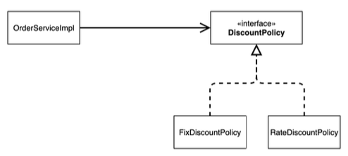

# 객체 지향 원리 적용

### 새로운 할인 정책의 확장

- 기획자: 서비스 오픈 직전 할인 정책을 고정 금액 할인에서 정률 할인 정책으로 변경 요청
- 개발자: 처음부터 고정 금액 할인은 아니라고 했잖아여…..
- 기획자: 애자일 소프트웨어 개발 몰라요????!!! “계획을 따르기보다 변화에 대응 하기를”
- 개발자: ……(하지만 난 유연하게 설계가 가능하도록 객체지향 설계원칙을 준수했지 흐흐흐)

### 주문한 금액의 %를 할인해 주는 새로운 정책을 만들자

### RateDisountPolicy 추가



DiscountPolicy 인터페이스는 이전 예제에서 만들어 놓았다. 따라서 정률 할인 정책을 따르는 새로운 구현 클래스인 RateDiscountPolicy 클래스를 구현 하면 된다.

```java
public class RateDiscountPolicy implements DiscountPolicy{

    private int discountPercent = 10;

    @Override
    public int discount(Member member, int price) {
        if(member.getGrade() == Grade.VIP) {
            return price * discountPercent / 100;
        } else {
            return 0;
        }
    }
}
```

10퍼센트의 할인 정책을 주었다.

### Test

```java
class RateDiscountPolicyTest {

    RateDiscountPolicy discountPolicy = new RateDiscountPolicy();

    @Test
    @DisplayName("VIP는 10% 할인이 적용된다.")
    public void vip_o() {
        Member member = new Member(1L, "memberVIP", Grade.VIP);

        int discount = discountPolicy.discount(member, 10000);

        Assertions.assertThat(discount).isEqualTo(1000);
    }
}
```


- **실패 케이스**

```java
@Test
@DisplayName("BASIC 이면 할인이 적용되지 않아야 한다.")
public void basic_x() {
    Member member = new Member(1L, "memberVIP", Grade.BASIC);

    int discount = discountPolicy.discount(member, 10000);

    Assertions.assertThat(discount).isEqualTo(1000);
}

```


- **BASIC 일때 성공 케이스**

```java
@Test
@DisplayName("BASIC 이면 할인이 적용되지 않아야 한다.")
public void basic_o() {
    Member member = new Member(1L, "memberVIP", Grade.BASIC);

    int discount = discountPolicy.discount(member, 10000);

    Assertions.assertThat(discount).isEqualTo(0);
}
```


---

## 새로운 할인 정책 적용과 문제점

할인 정책을 애플리케이션에 젹용할 때 이전에 사용하던 고정 금액 할인 정책 FixDiscountPolicy 를 없애고 새로운 RateDiscountPolicy 를 넣어줄 떄 클라이언트인 OrderServiceImpl 코드를 뜯어 고쳐야한다.

```java
public class OrderServiceImpl implements OrderService{
...
		// private final DiscountPolicy discountPolicy = new FixDiscountPolicy();
    private final DiscountPolicy discountPolicy = new RateDiscountPolicy();
...
}
```

- 역할과 구현을 충실히 분리 → OK
- 다형성도 활용하고, 인터페이스와 구현 객체를 분리했다 → OK
- OCP, DIP 같은 설계원칙을 준수했는가?
→ 그렇게 보이지만 사실 아니다!!! 주문 서비스 구현체인 OrderServiceImpl 을 보자.

### 문제점

OrderServiceImpl은 인터페이스에 의존하면서 구체 클래스에도 의존하고 있다.

- 인터페이스 의존: DiscountPolicy
- 구체 클래스 의존: FixDiscountPolicy, RateDiscountPolicy

**DIP 를 위반**하고 있다.

현재 코드는 기능을 확장해서 변경하게 되면 클라이언트 코드에 영향을 준다.

**OCP 위반**

### 실제 의존관계


위에서 만든 클래스 다이어그램과는 다르게 현재코드는 OrderServiceImpl 이 DiscountPolicy 인터페이스와 FixDiscountPolicy에 의존하고 있다. 따라서 **DIP를 위반**하는 것을 볼 수 있다.

### 정책 변경후 관계


FixDiscountPolicy에서 RateDiscountPolicy 로 정책을 변경하는 순간 OrderServiceImpl 가 구현체에 의존하고 있으므로 소스코드의 변경이 생겨 **OCP 를 위반**한다.

### 어떻게 문제를 해결 할 수 있는가?

- 현재 인터페이스 뿐만 아니라 구현체에도 의존을 하고있다. 따라서 인터페이스에만 의존하도록 설계를 변경해야 한다.


### 인터페이스에만 의존하도록 코드 변경

```java
public class OrderServiceImpl implements OrderService{
    ...
	// private final DiscountPolicy discountPolicy = new FixDiscountPolicy();
  // private final DiscountPolicy discountPolicy = new RateDiscountPolicy();
    private DiscountPolicy discountPolicy;
    ...
}
```


이전에 만들었던 주문을 생성하는 테스트 코드를 실행해보면 NullPointException이 발생하면서 테스트가 실패하는 것을 볼 수 있다.

### 해결방안

**누군가, 어디선가 클라이언트인 OrderServiceImpl에 DiscountPolicy의 구현 객체를 대신 생성해주고 주입해 주어야 한다.**

---

## **관심사의 분리**

애플리케이션을 하나의 공연이라 생각해보자.

각각의 인터페이스를 배역이라고 생각하면 실제 배역에 맞는 배우를 선택하는 것은 누가 하나????

즉, 로미오와 줄리엣 공연을 하면 로미오 역할을 누가 할지 줄리엣 역할을 누가 할지 선택해 주는 담당자가 있어야한다. 로미오 역할(인터페이스)를 맡을 배우 디카프리오(구현체), 줄리엣 역할(인터페이스)를 맡을 배우(구현체)를 섭외하는 것과 같은 역할이 있어야한다.

이전 코드는 로미오 역할을 맡을 배우 디카프리오가 줄리엣 역할을 하는 여자 주인공을 직접 섭외하는 것과 같다. 배우가 연기뿐 아니라 섭외까지 맡아버리는 **다양한 책임**을 가지고 있다.

### 관심사를 분리하자! → 배우는 배역만 수행하고, 공연 기획자가 나와서 배우를 지정하자!!

- 배우는 본인의 역할인 배역을 수행하는 것에만 집중해야한다.
- 디카프리오는 어떤 여자 주인공이 선택되더라도 똑같이 공연을 할 수 있어야 한다.
- 역할에 맞는 배우를 지정하는 책임을 담당하는 별도의 공연 기획자가 나올 시점이다.

### AppConfig

애플리케이션의 전체 동작 방식을 구성(config)하기 위해, **구현객체를 생성하고, 연결하는 책임을 가지는 별도의 설정 클래스**를 만들자.

```java
public class AppConfig {
    
    public MemberService memberService() {
        return new MemberServiceImpl(new MemoryMemberRepository());
    }
    
    public OrderService orderService() {
        return new OrderServiceImpl(
                new MemoryMemberRepository(),
                new FixDiscountPolicy()
        );
    }
}
```

AppConfig는 애플리케이션의 실제 동작에 필요한 **구현 객체를 생성**한다.

- memberService() 에서 MemberServiceImpl 구현 객체를 선택하고 MemberServiceImpl 에서 사용할 회원 저장소 구현체는 MemoryMemberRepository를 선택했다.
- 마찬가지로 orderService() 에서는 OrderServiceImpl 구현체를 만들고 OrderServiceImpl 에서 사용할 회원 저장소 구현체와 할인 정책을 생성자로 넣어주고 있다.

> 여기까지 코드를 구현했으면 AppConfig 에서 컴파일 에러가 발생한 것을 볼 수 있는데 아직 각각의 구현체에 생성자를 만들어주지 않았기 때문에 에러가 발생하는 것이다. 바로 다음 생성자를 만들것이다.
> 

### MemberServiceImpl - 생성자 주입

```java
public class MemberServiceImpl implements MemberService{
    private final MemberRepository memberRepository;
    
    public MemberServiceImpl(MemberRepository memberRepository) {
        this.memberRepository = memberRepository;
    }

    @Override
    public void join(Member member) {
        memberRepository.save(member);
    }

    @Override
    public Member findMember(Long memberId) {
        return memberRepository.findById(memberId);
    }
}
```

이제 MemberServiceImpl 은 MemoryMemberRepository를 의존하지 않는다!!! 그저 MemberRepository 인터페이스에만 의존하게 됐다. 따라서 MemberSerivceImpl 입장에서는 생성자를 통해 어떤 구현 객체가 들어올지 알 수 없다. AppConfig를 통해서 결정되므로 이제부터 MemberServiceImpl 은 **의존관계에 대한 고민은 외부**(AppConfig)에 맡기고 **실행에만 집중**하면 된다.

### OrderServiceImpl - 생성자 주입

```java
public class OrderServiceImpl implements OrderService{
    private final MemberRepository memberRepository;
    private final DiscountPolicy discountPolicy;
    
    public OrderServiceImpl(MemberRepository memberRepository, DiscountPolicy discountPolicy) {
        this.memberRepository = memberRepository;
        this.discountPolicy = discountPolicy;
    }
    @Override
    public Order createOrder(Long memberId, String itemName, int itemPrice) {
        Member member = memberRepository.findById(memberId);
        int discountPrice = discountPolicy.discount(member, itemPrice);

        return new Order(memberId, itemName, itemPrice, discountPrice);
    }
}
```

MemberServiceImpl 과 마찬가지로 OrderServiceImpl는 MemberRepository, DiscountPolicy 인터페이스에만 의존을 하고 **실행에만 집중**할 수 있게 됐다.

### 클래스 다이어그램


- 객체의 생성과 연결은 AppConfig가 담당
- **DIP 완성**
MemberServiceImpl은 MemberRepository **인터페이스에만 의존**
OrderServiceImple은 MemberRepository, DiscountPolicy **인터페이스에만 의존**
- 관심사의 분리: 객체를 생성하고 연결하는 역할과 실행하는 역할이 명확히 분리되었다.

### 회원 객체 인스턴스 다이어그램

클라이언트인 MemberServiceImpl 입장에서 바라보자.


appConfig 객체는 memoryMemverRepository 객체를 생성하고 memberServiceImpl 을 생성하면서 생성했던 memoryMemberRepository 객체를 생성자로 전달해준다.

클라이언트인 memberServiceImpl 입장에서 보면 의존관계를 마치 외부에서 주입해주는 것 같다고 해서 DI(Dependency Infection)이라고 표현한다.(의존관계 주입, 의존성 주입)

---

## Test

아마 OrderService 를 테스트 하기 위해 만든 테스트 코드에 컴파일 에러가 발생했을 것이다. 이는 생성자를 구현했는데 아직 값이 들어가지 않아 뜨는 에러이다.

이제 AppConfig 라는 의존관계를 주입해주는 클래스를 만들었으니 이를 이용해 테스트 코드를 수정해보자.

### MemberServiceTest

```java
public class MemberServiceTest {
    MemberService memberService;
    
    @BeforeEach //각각의 테스트가 실행되기 전에 실행된다. 테스트가 2개 있으면 2번 실행된다.
    public void beforeEach() {
        AppConfig config = new AppConfig();
        memberService = config.memberService();
    }

    @Test
    void join() {
        Member member = new Member(1L, "memberA", Grade.VIP);

        memberService.join(member);
        Member findMember = memberService.findMember(1L);

        Assertions.assertThat(member).isEqualTo(findMember);
    }
}
```

### OrderServiceTest

```java
class OrderServiceTest {
    MemberService memberService;
    OrderService orderService;

    @BeforeEach //각각의 테스트가 실행되기 전에 실행된다. 테스트가 2개 있으면 2번 실행된다.
    public void beforeEach() {
        AppConfig config = new AppConfig();
        memberService = config.memberService();
        orderService = config.orderService();
    }

    @Test
    public void createOrder() {
        long memberId = 1L;
        Member member = new Member(memberId, "memberA", Grade.VIP);
        memberService.join(member);

        Order order = orderService.createOrder(memberId, "itemA", 10000);
        Assertions.assertThat(order.getDiscountPrice()).isEqualTo(1000);
    }
}
```


join, createOrder 테스트 모두 성공하는 것을 확인할 수 있다.

---

### 참고

> 인프런에 있는 김영한님의 ‘스프링 핵심 원리 - 기본편’ 강의를 듣고 내용을 정리했습니다. 자세한 내용은 강의를 통해 확인할 수 있습니다.
> 
> 
> [스프링 핵심 원리 - 기본편 - 인프런 | 강의](https://www.inflearn.com/course/%EC%8A%A4%ED%94%84%EB%A7%81-%ED%95%B5%EC%8B%AC-%EC%9B%90%EB%A6%AC-%EA%B8%B0%EB%B3%B8%ED%8E%B8/)
>